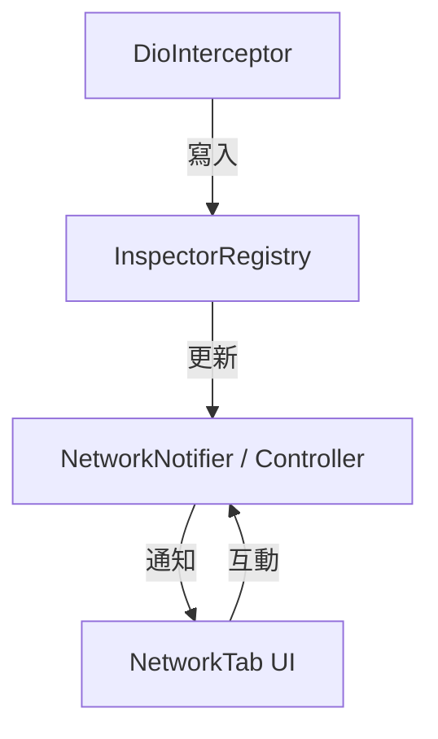

# Flutter Inspector 架構與代碼風格對比報告

本報告參考 **對照組專案**的工程準則與架構設計，對比當前 `flutter_inspector`（下稱**當前專案**）的 `lib` 與 `example/lib` 目錄，旨在評估其代碼品味、職責拆分、命名慣例，並給出具體的架構調整與重構建議。

---

## 🐧 核心審查與品味評級 (Linus' Taste Rating)

### 🟢 好的部分 (Good Taste)
* **工具性與純粹性**：`utils/network_formatters.dart` 等工具函數保持了 Dart 純函數 (Pure Functions) 結構，不依賴 Flutter UI 套件，這使得它們具備極高的可測試性，符合實用主義。
* **安全性默認**：在 `redactSensitiveData` 的設計上，預設為 `true` 以防敏感資訊（如 authorization token）外洩到剪貼簿，這體現了良好的「向後相容與安全默認」品味。

### 🔴 垃圾/平庸的部分 (Bad Taste & Flaws)
* **超級上帝類別 (God Class)**：`FlutterInspector` 類別同時管理核心 Registry、初始化、全域例外鉤子（error hooks）、UI FAB 懸浮按鈕的 attach/detach 與 Dashboard 彈窗的打開。這嚴重違反了 **單一職責原則 (SRP)**。
* **UI 與業務邏輯緊密耦合**：`NetworkTab` 等 UI 元件直接在 `build` 方法中呼叫 `applyNetworkFilter` 做資料過濾與狀態更新，並且依賴 `setState` 刷新整個視圖。當資料量變大時，容易造成嚴重卡頓。
  > ✅ **2026-07-05 部分處理**：`NetworkTab` 已拆為 `_SearchBar` / `_FilterChips` / `_EntryTile` / `_MethodBadge` 四個 widget class，function widget 清零；純函數（`timeOf` 等）與常數（`httpMethods`、`statusLabels`）集中至 `network_utils.dart`。`build` 內呼叫 `applyNetworkFilter` 的耦合**保留**——buffer 上限 500 筆、過濾為微秒級，「資料量變大卡頓」的疑慮經評估不成立。
* **命名不一致**：`models/` 下的概念混亂。`database_entry.dart`、`network_entry.dart` 等「Entry」物件在系統中同時扮演了 Dto、Domain Entity 與 UI Model 的三重身形，沒有做到邏輯層的隔離。

---

## 🔍 架構與職責對比分析

### 1. 專案結構 (Structure)

| 維度 | 對照組專案 | 當前專案 (flutter_inspector) |
| :--- | :--- | :--- |
| **架構模式** | **Clean Architecture** (清晰的三層結構) | **扁平技術分包** (Technical Grouping) |
| **層級隔離** | `Presentation` $\rightarrow$ `Domain` $\rightarrow$ `Data`。層級間嚴格單向依賴，不可穿透。 | 混雜在單一 package 下，`ui` 直接呼叫底層 models 與核心 core，缺乏邊界。 |
| **業務邏輯位置** | 封裝在 `domain/` 的 `UseCase` 中，無 UI 依賴。 | 直接寫在 `StatefulWidget` 的狀態更新與輔助 method 中。 |
| **實體隔離** | 區分為 `Entity` (業務)、`Dto` (資料庫/網路)、`Model` (UI顯示)。 | 統一使用 `Entry`（如 `NetworkEntry`）。 |

> [!WARNING]
> 當前專案的扁平技術分包雖然在小型 package 中看起來簡單，但當 inspector 要擴充支援如 GraphQL、Websocket、或更多資料庫類型時，這種結構會迅速崩塌，導致 `core/` 與 `ui/` 的代碼量以幾何級數增加。

### 2. 狀態管理與職責 (State Management & Responsibilities)

* **對照組專案**：嚴格規定 UI 只能負責 Layout 聲明，商業邏輯與過濾必須交給狀態管理器（`flutter_bloc`）。
* **當前專案**：UI 層承載了太多「計算邏輯」與「資料變更」。
  * 範例：[network_tab.dart](file:///Users/yomiry/StudioWorkspace/flutter_inspector/lib/src/ui/dashboard/tabs/network_tab.dart) 內部的 `build` 方法中：
    ```dart
    final all = widget.inspector.networkEntries;
    final entries = applyNetworkFilter(all, _filter);
    ```
    UI 必須自己去拿原始 `networkEntries`，自己去跑 `applyNetworkFilter`。
  * 改進方向：即使不依賴 BLoC，也應引入簡單的 `ChangeNotifier` 或 `ValueNotifier`（例如 `NetworkController`），由它負責持有 entries、filter 與 filtering 邏輯，UI 僅訂閱此 Controller。
  > ❌ **2026-07-05 未採納 Controller**：filtering 邏輯已是 `network_utils.dart` 的純函數且有獨立單元測試，Controller 能提供的可測試性已經存在；State 僅剩 4 個欄位與 `_toggle`/`_refresh` 兩個 glue 方法，再抽一層 `ChangeNotifier` 是淨增一個檔案與一層 `ListenableBuilder` 縮排，`network_tab.dart` 不會更簡潔。詳見階段一的落地狀態註記。

### 3. 命名慣例 (Naming)

* **對照組專案**：
  * UseCase: `[Feature]UseCase` / `[Feature]UC`
  * Entity: `[Feature]Entity`
  * DTO: `[Feature]Dto`
  * UI Model: `[Feature]Model`
* **當前專案**：
  * 當前專案的 `Entry`（如 `NetworkEntry`）其實是 Data 層的 DTO（如 `Dio` 攔截到的 Response/Request），但它被直接拿去 UI 層渲染。
  * 建議：為了防止 Userspace 破壞（Never break userspace），我們不必強行拆分出 Dto，但可以將 `models/` 下的 `Entry` 重命名或對齊為 `Model` 或保持 `Entry` 但在內部限制其變更。

---

## 🛠️ Linus 式重構方案 (Recommended Adjustments)

為了解決上述「品味問題」且**不破壞現有使用者空間 (Never break userspace)**，建議進行以下三個階段的重構：

### 階段一：職責拆分——引入 Controller 隔離 UI 與核心

不要讓 UI 直接與 `FlutterInspector` 的緩衝區對接。我們可以使用 Flutter 原生的 `ValueNotifier` 來管理各個 Tab 的狀態。



* **具體作法**：
  1. 建立 `src/controllers/network_controller.dart`，將 `NetworkTab` 內部的 `_searchController`、`_keyword`、`_methods`、`_statusGroups` 與過濾邏輯（`applyNetworkFilter`）全部移入該 Controller。
  2. `NetworkTab` 轉為 `StatelessWidget`（或僅保留基本動畫的 `StatefulWidget`），透過 `ListenableBuilder` 或 `AnimatedBuilder` 監聽 `NetworkController`。
  3. 這可以將 UI 層的縮排與複雜度砍掉一半以上，消滅 UI 中的計算邊界情況。

> [!NOTE]
> **階段一落地狀態（2026-07-05）——以替代方案完成，未採納 Controller**
>
> * ✅ **已完成（widget class 拆分路線）**：
>   * `NetworkTab` 的三個 `_buildXxx` helper method 全數改為獨立 widget class：`_SearchBar`、`_FilterChips`、`_EntryTile`（加上原有 `_MethodBadge` 共四個），狀態仍由 `_NetworkTabState` 持有，widget 只收資料與 callback。
>   * method/statusGroup 重複的 add/remove 分支收斂為單一泛型 `_toggle<T>`。
>   * `network_search.dart` 更名為 `network_utils.dart`，`timeOf`、`httpMethods`、`statusLabels` 集中至該檔（維持純函數、可獨立測試）。
> * ❌ **未採納：`NetworkController`（本節具體作法 1、2）**。理由：過濾邏輯已是有測試的純函數；State 剩餘內容是 glue 而非邏輯；引入 Controller 對 `network_tab.dart` 是行數持平、總量淨增。本 package 規模（buffer 500 筆）不構成對照組式分層的動機。
> * 🔁 **重新評估條件**（任一成立時再引入 Controller）：需要 live auto-update（`NetworkInspector.onAdd` 目前為單一 callback slot、已被通知功能佔用，屆時需一併改為可多方訂閱）；filter 狀態需跨 dashboard 開關保留；多個入口需共享同一份過濾狀態。
> * ⚠️ **勘誤**：上方 mermaid 圖中的 `NetworkNotifier` 與既有 `lib/src/notifications/` 的通知類別撞名，未來若實作僅能命名為 `NetworkController`；具體作法 2 的「轉為 `StatelessWidget`」不可行——Controller 的生命週期（dispose）需由 State 管理。

### 階段二：分離 UI 與核心 Hook 職責 (解耦 God Class)

`FlutterInspector` 目前承載了過多職責。應將 UI 掛載（FAB Overlay）與 錯誤攔截器（Error Hooks）拆分出去。

* **具體作法**：
  1. **錯誤攔截解耦**：建立 `src/core/uncaught_error_handler.dart`，將 `setupErrorHandlers` 與 `_logFlutterError` 移過去。`FlutterInspector` 僅需在建構子中呼叫 `UncaughtErrorHandler.bind(this)`。
  2. **FAB Overlay 解耦**：建立 `src/ui/inspector_overlay_manager.dart`，負責 `attach` 與 `detach` 的 `OverlayEntry` 邏輯。
  3. 重構後的 `FlutterInspector` 將只作為一個乾淨的 **Facade API**，只負責對外曝露配置與 Registry 接口，代碼量可從 350 行縮減至 100 行以內。

### 階段三：消滅邊界情況 (Good Taste Polish)

* **集合操作安全**：當前專案未嚴格執行「嚴禁 `firstWhere`，必須使用 `firstWhereOrNull`」。
  * 檢查 `lib/src/` 中是否有直接使用 `.firstWhere` 的危險操作。
* **樣式硬編碼**：
  * 當前專案的 UI 有許多硬編碼顏色與邊距。建議仿照對照組專案的 `foundation/style`，在 `lib/src/ui/theme/` 中建立一個簡單的 `InspectorTheme`（或 `InspectorColors`），統一管理字型大小、顏色、邊距，避免 UI 代碼中散落各種 const。

---

## 📋 範例專案 (example/lib) 調整建議

當前專案的 `example/lib/main.dart` 寫法有些混雜：
1. **全域變數污染**：在 [main.dart:L11](file:///Users/yomiry/StudioWorkspace/flutter_inspector/example/lib/main.dart#L11) 宣告了 `late final FlutterInspector inspector;`。
   * **改進**：在大專案中，全域 late final 變數是 bug 的溫床。應該將其註冊在依賴注入框架中（如對照組使用的 `get_it`），或者透過 `InheritedWidget` (或狀態管理 framework 的 Provider) 進行傳遞。
2. **範例結構化**：`example/lib/demos` 目前包含 `network_demo.dart`, `objectbox_demo.dart`, `sqlite_demo.dart`。這些寫法良好，但可以透過單一的 `DemoController` 來統一管理展示狀態，而不是把 Demo 實體直接 new 在 `_MyHomePageState` 中。
