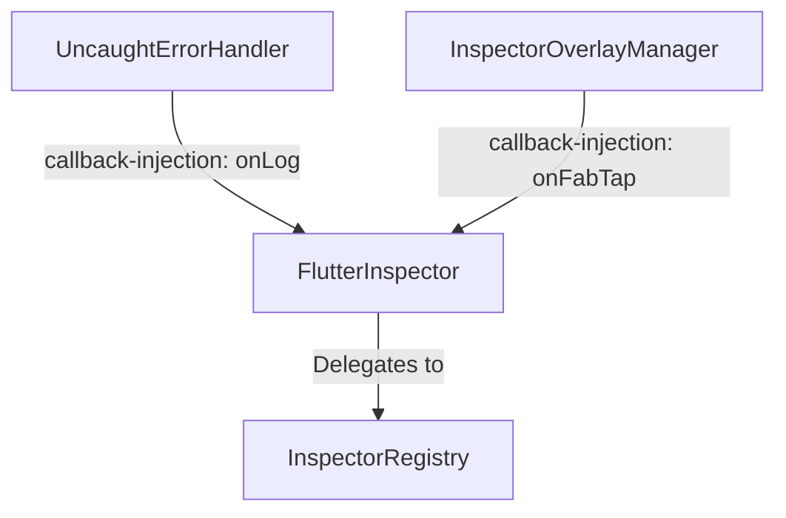

# Flutter Inspector 架構與代碼風格對比報告 (更新於 2026-07-19)

本報告參考 **對照組專案** 的工程準則與架構設計，對比當前 `flutter_inspector`（下稱**當前專案**）的 `lib` 與 `example/lib` 目錄，旨在評估其代碼品味、職責拆分、命名慣例，並記錄已落地的架構調整、重構實作與核心設計權衡。

---

## 🐧 核心審查與品味評級 (Linus' Taste Rating)

### 🟢 好的部分 (Good Taste)
* **工具性與純粹性**：`utils/network_formatters.dart` 等工具函數保持了 Dart 純函數 (Pure Functions) 結構，不依賴 Flutter UI 套件，這使得它們具備極高的可測試性，符合實用主義。
* **安全性默認**：在 `redactSensitiveData` 的設計上，預設為 `true` 以防敏感資訊（如 authorization token）外洩到剪貼簿，這體現了良好的「向後相容與安全默認」品味。
* **窄契約與時序軸擴展**：透過 `TimestampedEntry` 窄契約介面（`abstract interface class`）統一了日誌、網路、導航與資料庫的事件結構，並以此將時序軸的設計同時推廣至 UI 視圖（`ConsoleTab`）與 Markdown 報告導出（`DiagnosticReport`），實現了兩端設計的一致性。

### 🔴 已解決的壞品味與平庸部分 (Resolved Bad Taste & Flaws)
* **超級上帝類別 (God Class) 的徹底解耦**：原本 `FlutterInspector` 同時管理 core Registry、初始化、錯誤攔截與 FAB UI Overlay，違反了 **單一職責原則 (SRP)**。現已將錯誤處理與 UI Overlay 邏輯解耦至 `UncaughtErrorHandler` 與 `InspectorOverlayManager`（均位於 `lib/src/core/`），兩者完全藉由 callback 注入與 `FlutterInspector` 溝通，無任何反向依賴，使 `FlutterInspector` 收斂為極其乾淨的 Facade API。
* **UI 與業務邏輯緊密耦合 (UI Tab 解耦)**：原本各個 Tab Widget 內部充斥著大量的 `_buildXxx` 等輔助方法（Helper Methods），使得單一類別的縮排與複雜度過高。現已完全移除 `ConsoleTab`、`NetworkTab`、`NavigatorTab`、`DatabaseTab`、`TableRowsView` 內部的 Helper Methods，改以獨立的私有 Widget 類別替代，顯著降低了嵌套層次。
* **跨檔案代碼拷貝的消除**：為消除 `LogDetailView`、`NetworkDetailView` 等視圖中重複手寫的卡片與鍵值佈局，我們建立了共用 UI Widget：`DetailSection`（與 `DetailKeyValueRow`）以及 `ErrorCard`（用於錯誤與重試 UI），徹底消除了跨檔案的 UI 拷貝。
* **樣式硬編碼的消除**：原本 UI 代碼中散落了大量的 const 顏色與邊距值。我們在 `lib/src/ui/theme/` 下建立了 `theme.dart` barrel 檔案，並將設計代幣（design tokens）細分實作至 6 個樣式類別（`ThemeColor`、`ThemePadding`、`ThemeRadius`、`ThemeSize`、`ThemeSpacing` 與 `ThemeTextStyle`），統一了視覺風格的管理。

---

## 🔍 架構與職責對比分析

### 1. 專案結構 (Structure)

| 維度 | 對照組專案 | 當前專案 (flutter_inspector) |
| :--- | :--- | :--- |
| **架構模式** | **Clean Architecture** (清晰的三層結構) | **扁平技術分包** (Technical Grouping) |
| **層級隔離** | `Presentation` $\rightarrow$ `Domain` $\rightarrow$ `Data`。層級間嚴格單向依賴，不可穿透。 | 混雜在單一 package 下，`ui` 直接呼叫底層 models 與核心 core，藉由 `FlutterInspector` Facade 進行互動。 |
| **業務邏輯位置** | 封裝在 `domain/` 的 `UseCase` 中，無 UI 依賴。 | 寫在 UI 的 `StatefulWidget` 狀態更新或 `network_utils.dart` 等純函數中。 |
| **實體隔離** | 區分為 `Entity` (業務)、`Dto` (資料庫/網路)、`Model` (UI顯示)。 | 統一使用 `Entry`（如 `NetworkEntry`），並實作 `TimestampedEntry` 契約。 |

> **Linus 實用主義評註**：雖然扁平技術分包缺乏嚴格的層級邊界，但對於輕量型的 Debug Tool Package 而言，這是一種「剛剛好」的實用設計。只要我們嚴格維持 core 協作器的單向依賴（Facade 模式）並將純計算邏輯抽離為純函數，就無需為了應對臆想中的複雜度而引入沉重的 Usecase 或 Repository 層。

### 2. 狀態管理與職責 (State Management & Responsibilities)

* **對照組專案**：UI 僅負責 Layout 聲明，商業邏輯與過濾必須交給狀態管理器（`flutter_bloc`）。
* **當前專案**：UI 層（例如 `NetworkTab`、`ConsoleTab`）的 `StatefulWidget` 直接持有 filter 狀態，並在 `build` 方法中同步呼叫 `applyNetworkFilter` 或 `mergedTimeline` 執行資料過濾與狀態生成。
* **權衡與決策**：
  * 當前專案並未引入額外的 `NetworkController` 或 `ChangeNotifier`。
  * **原因**：核心緩衝區使用 `RingBuffer` 實現，其最大容量鎖定在 `bufferSize = 500`（或相似規模）。所有過濾操作皆為記憶體內運行的純函數，執行耗時在微秒（$\mu s$）級別，不會對 UI 幀率構成威脅。
  * 若強行引入 Controller 層，會增加至少一個類別定義、額外的 `ListenableBuilder` 嵌套以及生命週期銷毀（`dispose`）的代碼，違反了 **YAGNI (You Aren't Gonna Need It)** 與 Ponytail 最小化原則。因此，**保留 build 內部的同步過濾，同時重構 Widget 類別以降低 UI 代碼複雜度** 是最具品味的折衷方案。

### 3. 命名慣例 (Naming)

* **對照組專案**：
  * UseCase: `[Feature]UseCase`
  * Entity: `[Feature]Entity`
  * DTO: `[Feature]Dto`
  * UI Model: `[Feature]Model`
* **當前專案**：
  * 依然保持 `Entry`（如 `NetworkEntry`、`LogEntry`）的命名，以防止破壞外部使用者的調用介面（**Never break userspace**）。
  * 引入 `TimestampedEntry` 作為窄契約介面（`abstract interface class`），為所有需要加入時序軸的事件物件提供統一的 `timestamp` 排序鍵，並藉由 `TimestampedEntryDisplay` extension 提供 DRY（Don't Repeat Yourself）的 `displayTime` 統一格式。

---

## 🛠️ Linus 式解耦設計與實作落地

當前專案的重構圍繞著三大主軸：**上帝類別解耦**、**UI Tab 解耦** 與 **時序軸重構**，其具體實作與落地狀態如下：

### 1. 上帝類別 (God Class) 徹底解耦

為使 `FlutterInspector` 回歸為乾淨的 Facade API，我們將「錯誤鉤子掛載」與「FAB 懸浮按鈕生命週期管理」這兩個與核心 Registry 無關的職責徹底抽離。



* **`UncaughtErrorHandler` (`lib/src/core/uncaught_error_handler.dart`)**：
  * **職責**：集中註冊與串接 Flutter 架構的三個標準錯誤鉤子（`FlutterError.onError`、`PlatformDispatcher.instance.onError` 與 `ErrorWidget.builder`）。
  * **解耦機制**：透過 `LogCallback` 構造函數注入 `onLog` 回呼函數。其內部完全沒有導入或依賴 `FlutterInspector`。
* **`InspectorOverlayManager` (`lib/src/core/inspector_overlay_manager.dart`)**：
  * **職責**：管理 `InspectorFab` 懸浮按鈕的 Overlay 生命週期（`attach`、`detach`）。
  * **解耦機制**：透過 `onFabTap` 構造函數注入。同樣地，該管理器對 `FlutterInspector` 具有 **零反向依賴**。
* **Facade API 收斂**：
  * 重構後的 `FlutterInspector` 僅在建構時將自身的 `log` 方法與 `openDashboard` 方法以 callback 形式傳遞給上述兩個管理器。其自身的代碼收斂為簡潔的屬性轉發與 Registry 接線，職責非常純粹。

### 2. UI Tab 解耦與元件提取

我們消滅了各個 UI 視圖中的輔助方法（Helper Methods），並將它們改寫為獨立的 Widget 類別以增進效能與可讀性：

* **Helper Methods 的消除**：
  * **ConsoleTab**：移除 `_buildRow` 等 5 個 Helper Methods，改為 `_EntryRowDispatcher` 與 4 個對應 Entry 類別的私有 Row Widget（如 `_LogEntryRow`）。
  * **NetworkTab**：移除 Helper Methods，解耦為獨立 Widget：`_SearchBar`、`_FilterChips` 與 `_EntryTile`。
  * **NavigatorTab**：解耦出 `_ActiveStackView` 與 `_CurrentBadge`。
  * **DatabaseTab & TableRowsView**：將主體佈局分別解耦為 `_DatabaseTabBody` 與 `_TableRowsBody`，並抽離出 `_CellDetailsBottomSheet` 與 `_StatusBar`。
* **共用元件提取**：
  * 提取 `lib/src/ui/widgets/detail_section.dart`（包含 `DetailSection` 與 `DetailKeyValueRow`），供 `LogDetailView` 與 `NetworkDetailView` 統一呼叫，徹底消除了跨檔案的 Key-Value 佈局拷貝。
  * 提取 `lib/src/ui/widgets/error_card.dart`（提供 `ErrorCard`），統一了 `DatabaseTab` 與 `TableRowsView` 載入失敗時的錯誤與重試 UI 呈現。

### 3. 時序軸重構 (Timeline Redesign)

時序軸的重新設計圍繞著窄契約 `TimestampedEntry` 展開，並將該時序軸串流無縫整合至診斷報告中。

* **排序契約與格式統一**：
  * `TimestampedEntry` 定義為 `abstract interface class`，強制衍生類別只能 `implements` 以鎖死契約。
  * 提供 `TimestampedEntryDisplay` extension，統一導出 `HH:mm:ss.mmm` 格式的 `displayTime`。
* **`DiagnosticReport` (`lib/src/utils/diagnostic_report.dart`) 整合**：
  * 診斷報告導出的 `Logs` 區段現已替換為按時間降序排列的 Chronological mixed `Timeline` Markdown 表格。
  * `errorsOnly` 過濾開關套用至整個時序軸串流（僅保留錯誤/警告日誌，以及 `statusCode >= 400` 或帶有 transport 錯誤的網絡請求；無錯誤語意的導航與資料庫事件則被濾除），確保了在 UI 端與報告導出端邏輯的一致。

### 4. WebView Bridge 架構解耦與防禦性設計

在引入 WebView 的支援時，我們遵循了「不破壞核心」、「防禦敵意輸入」與「追蹤來源」的核心設計準則：

* **Adapter Pattern (翻譯器非系統)**：
  * JS Bridge 被實作為一個「翻譯器 (Adapter)」，而非一個全新的子系統。它負責將來自 Web 端的外部輸入，直接映射並轉換為既有的 `LogEntry` 與 `NetworkEntry`。
  * 這避免了為 WebView 單獨建立一套新的資料流或 UI 視圖，保持了既有時序軸（Timeline）與資料庫設計的純潔性，完美實踐了「消除特殊情況」的好品味。
* **Provenance Metadata (來源溯源)**：
  * 為了解決來源追蹤的脆弱性，我們引入了 `NetworkOrigin` 列舉與 `pageUrl` 屬性，明確標記事件的發源地。
  * 徹底廢棄了過去依賴 `sourceDio == null` 這類隱含狀態（且容易受到 `WeakReference` GC 回收影響而失真）的脆弱檢查，轉而使用明確的元資料標記，提升了資料結構的堅固性。
* **Hostile Input Hardening (敵意輸入防護)**：
  * 秉持「絕不破壞用戶空間」的鐵律，我們將 WebView 的 payload 視為不可信的敵意輸入。
  * 在 JS 端實施字串長度截斷（MAX_CHARS），在 Dart 端設置 256KB 的解碼上限，並透過嚴謹的邊界與 `try-catch` 防護，確保 Flutter UI Isolate 不會因為惡意的 Web payload 而遭遇 OOM 或崩潰。這反映了極高的安全默認與系統穩定性品味。

---

## 📋 範例專案 (example/lib) 評估與現況驗證

我們對範例專案進行了實際 codebase 驗證，確認其架構設計與先前報告的評估一致：

1. **全域變數污染依舊存在**：
   在 `example/lib/main.dart` 中，依然存在全域變數宣告：
   ```dart
   late final FlutterInspector inspector;
   final GlobalKey<NavigatorState> navigatorKey = GlobalKey<NavigatorState>();
   ```
2. **Demo 物件生命週期繫結**：
   `NetworkDemo`、`SqliteDemo` 與 `ObjectBoxDemo` 依然被直接實例化在 `_MyHomePageState` 的 `initState()` 中，其生命週期與此單一頁面的狀態（State）緊密綁定。
3. **現況驗證結論**：
   此結論依舊成立。對於單純的範例 App（example app），使用全域變數與直接實例化元件符合**實用主義**，不引入額外的依賴注入框架（如 `GetIt`）可保持範例的極簡性。然而，在大型生產環境的宿主 App 中，強烈建議使用依賴注入（Dependency Injection，如 `get_it`）或狀態管理套件（如 `Provider`/`Riverpod`）來注入與管理 `FlutterInspector` 的生命週期，以防範全域變數初始化順序不當或記憶體外洩的風險。

---

## ⚖️ 架構權衡與折衷 (Architectural Trade-offs)

### 診斷報告中的時序軸與細節區段之冗餘 (Redundancy vs Completeness)

在 `DiagnosticReport` 的 `buildDiagnosticReport` 實作中，當用戶導出報告時，報告內同時包含了 mixed Chronological Timeline 表格，以及下方獨立的 Network、Navigation、Database 詳細事件區段。這引入了以下設計折衷：

* **冗餘性 (Redundancy)**：同一個網路請求或資料庫操作，既會以一行的形式出現在頂部的 Timeline 中，也會在下方的詳細區段中完整輸出。這導致 Markdown 報告存在一定程度的重複內容。
* **完整性 (Completeness)**：
  * 時序軸（Timeline）旨在呈現 **因果鏈 (Causality)**：當例外（Error）發生時，開發者需要一眼看出其前後幾秒內發生了哪些資料庫操作、發送了哪些 HTTP 請求或切換了哪些頁面。
  * 詳細區段（Detail Sections）則旨在提供 **排查依據 (Diagnostic Payload)**：當看到 Timeline 中某個網路請求失敗時，開發者需要去詳細區段查看完整的 JSON Response、Request Header 或 SQL 語句。
* **決策**：為了保證生產環境下排查問題的上下文完整度，我們認為這種**結構化冗餘是高度實用且必要的**。比起縮減報告大小，我們更重視「排查問題時不遺漏任何足跡」。
