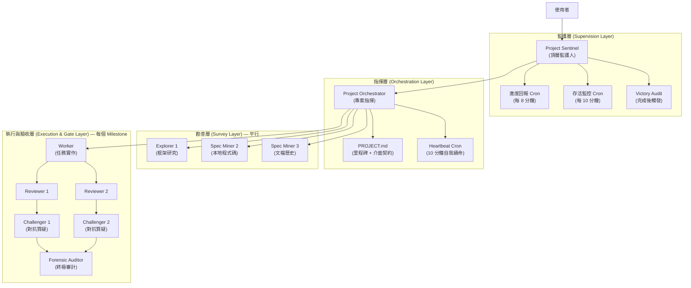

# 以 Skill 重現 teamwork-preview 的完整架構設計

> **核心判斷**：✅ 值得做。teamwork-preview 是黑箱二進位，無法客製化、無法調整驗證邏輯、無法控制成本。
> 以 Skill 重建可獲得完全透明的多智能體協作引擎，且能與現有 `gen-dev-workflow` 生態無縫整合。

---

## 0. 逆向工程：teamwork-preview 實際做了什麼

從 Conversation `dd1390ff` 的 transcript 實測紀錄中，還原出 teamwork-preview 的**真實**運作架構：



### 觀察到的關鍵特性

| 特性 | 實測證據 |
|:-----|:---------|
| **雙層監護** | Sentinel 只做監控與進度匯報，不碰任務邏輯；Orchestrator 負責規劃與派發 |
| **平行勘查** | Step 0 同時派 3 個 Explorer 平行探索不同領域 |
| **里程碑驅動** | 任務以 M1→M2→M3→M4 順序推進，Milestone 間有明確的介面契約 |
| **四重驗收閘門** | Worker → 雙 Reviewer → 雙 Challenger → Auditor，全 PASS 才推進 |
| **檔案交接** | 每個 Agent 寫入獨立目錄（如 `.agents/orchestrator/m1/`），透過 `send_message` 通知 |
| **自我續命** | Orchestrator 設 Heartbeat Cron，Spawn Count 達 20 時 Self-succession |
| **獨立最終稽核** | 完成後 Sentinel 派獨立 Victory Auditor 對照原始需求做盲測 |

---

## 1. Skill 重現的角色架構設計

### 1.1 角色層級與職責

我把 teamwork-preview 的 5 層架構精簡為 **3 層 4 類角色**，消滅不必要的複雜度：

```
┌──────────────────────────────────────────────────────┐
│  Layer 0: Coordinator (協調者 — 就是主 Agent 自己)     │
│  ─ 需求收斂、PROJECT.md 規劃、Milestone 排程           │
│  ─ 進度監控、最終結果整合                               │
│  ─ 不需要額外 Sentinel，主 Agent 本身就是 Sentinel      │
└───────────────────────┬──────────────────────────────┘
                        │
        ┌───────────────┼───────────────┐
        ▼               ▼               ▼
┌──────────────┐ ┌──────────────┐ ┌──────────────┐
│ Layer 1:     │ │ Layer 1:     │ │ Layer 1:     │
│ Explorer     │ │ Explorer     │ │ Explorer     │
│ (勘查員)     │ │ (勘查員)     │ │ (勘查員)     │
│ 平行派發     │ │ 平行派發     │ │ 平行派發     │
└──────────────┘ └──────────────┘ └──────────────┘
        │               │               │
        └───────┬───────┘───────────────┘
                ▼
┌──────────────────────────────────────────────────────┐
│  Layer 2: Worker (執行者) — 每 Milestone 1~N 位       │
│  ─ 接收勘查報告 + Milestone 規格                      │
│  ─ 執行研究 / 寫程式 / 產文件                          │
│  ─ 寫入交付物至指定路徑                                │
└───────────────────────┬──────────────────────────────┘
                        │
                        ▼
┌──────────────────────────────────────────────────────┐
│  Layer 3: Verifier (驗證者) — 每 Milestone 1~2 位     │
│  ─ Reviewer: 檢查交付物是否符合規格                    │
│  ─ Challenger: 對抗式質疑，找出漏洞                    │
│  ─ 結果回傳 Coordinator 決定 PASS / RETRY              │
└──────────────────────────────────────────────────────┘
```

> **為什麼砍掉 Sentinel 層？**
> teamwork-preview 的 Sentinel 存在是因為它是黑箱系統，需要一個輕量監護者來橋接使用者與內部 Orchestrator。
> 在 Skill 模式下，**主 Agent 本身就是 Sentinel + Orchestrator**，不需要額外浪費一層。
> 這直接消滅了 Sentinel↔Orchestrator 之間的通訊開銷與 Context 浪費。

### 1.2 角色定義規格

| 角色 | TypeName | 數量 | Model | Workspace | Context 預算 | 職責 |
|:-----|:---------|:-----|:------|:----------|:------------|:-----|
| **Coordinator** | 主 Agent 自身 | 1 | inherit | inherit | 不限（有 Token Budget Gate） | 需求收斂、規劃、派發、監控、整合 |
| **Explorer** | `research` | 2~3 | `flash` | inherit | 極輕（唯讀搜尋） | 平行勘查：讀程式碼、讀文檔、搜 Web |
| **Worker** | `self` | 1~3 | `inherit` 或 `pro` | inherit | 中等（任務聚焦） | 執行 Milestone 任務：寫碼、寫文件 |
| **Reviewer** | `research` | 1~2 | `flash` | inherit | 極輕（唯讀審查） | 規格符合度審查 |
| **Challenger** | `research` | 1 | `flash` 或 `inherit` | inherit | 極輕（唯讀對抗） | 對抗式質疑，挑漏洞 |

---

## 2. 任務分配與生命週期

### 2.1 五階段生命週期

```
PHASE 0          PHASE 1           PHASE 2           PHASE 3          PHASE 4
需求收斂     →    平行勘查      →    里程碑執行     →    驗收閘門    →    最終整合
(Coordinator)    (Explorers)       (Workers)          (Verifiers)      (Coordinator)
                 ┌─ Explorer 1     ┌─ Worker M1       ┌─ Reviewer
                 ├─ Explorer 2     ├─ Worker M2  ←→   ├─ Challenger
                 └─ Explorer 3     └─ Worker M3       └─ (PASS/RETRY)
                       │                 │                    │
                       ▼                 ▼                    ▼
                  勘查報告           Milestone 產物       驗證判決
                  (handoff.md)       (交付檔案)          (PASS/FAIL)
```

### 2.2 各階段詳細流程

#### PHASE 0: 需求收斂 (Coordinator 親自執行)
```
輸入：使用者的原始需求
處理：
  1. 分析需求模糊度，用 ask_question 澄清
  2. 劃分 Milestones（2~5 個，有明確的輸入/輸出契約）
  3. 產出 PROJECT.md（含 Feature Inventory、Milestones、Interface Contracts）
  4. 等待使用者確認
輸出：PROJECT.md + 使用者 approval
```

#### PHASE 1: 平行勘查 (Explorers)
```
輸入：PROJECT.md 中定義的勘查範圍
處理：
  1. Coordinator 同時 invoke 2~3 個 research subagent
  2. 每個 Explorer 聚焦一個領域（如：外部框架、本地程式碼、文檔歷史）
  3. Explorer 將結果寫入 .agents/teamwork/<project>/survey/<explorer-id>.md
  4. Explorer 透過 send_message 通知 Coordinator 完成
等待：Coordinator 收齊所有 Explorer 的報告後才進入 PHASE 2
輸出：勘查報告集合
```

#### PHASE 2: 里程碑執行 (Workers)
```
輸入：PROJECT.md + 勘查報告
處理：
  for each Milestone in PROJECT.md:
    1. Coordinator 組裝 Worker Prompt（含 Milestone 規格 + 前序產物 + 勘查報告摘要）
    2. invoke_subagent(TypeName="self", Model=依複雜度選擇)
    3. Worker 執行任務，寫入交付物至指定路徑
    4. Worker 完成後 → 進入 PHASE 3 驗收
    5. 驗收 PASS → 下一個 Milestone
    6. 驗收 FAIL → 同一 Worker 修正（最多 2 次），仍 FAIL 則換新 Worker
輸出：各 Milestone 交付物
```

#### PHASE 3: 驗收閘門 (Verifiers)
```
輸入：Worker 的交付物 + Milestone 規格
處理：
  1. Coordinator 派 Reviewer (research subagent, flash)
     → 檢查清單：規格符合度、完整度、無遺漏
  2. Reviewer PASS 後，派 Challenger (research subagent, flash/inherit)
     → 對抗式檢查：嘗試找出邏輯漏洞、邊界錯誤、遺漏場景
  3. 兩者結果彙整，Coordinator 判定 PASS / RETRY
驗收標準：
  - Reviewer 明確回覆 "PASS" + 無阻塞性問題
  - Challenger 未找到致命缺陷（Minor findings 可接受）
輸出：PASS → 進入下一 Milestone / FAIL → 回 PHASE 2
```

#### PHASE 4: 最終整合 (Coordinator 親自執行)
```
輸入：所有已驗收的 Milestone 交付物
處理：
  1. 整合各 Milestone 產物為最終交付檔案
  2. 執行專案層級驗證（如 flutter test、lint）
  3. 向使用者呈現結果摘要
輸出：完成的專案交付物
```

---

## 3. Model Level / Effort 分配策略

這是成本控制的核心。Teamwork-preview 的一個主要問題是**所有角色都可能使用最昂貴的模型**，
我們的 Skill 版本需要精準控制：

### 3.1 Model 選擇矩陣

| 任務類型 | Model | 理由 |
|:---------|:------|:-----|
| **勘查 / 搜尋 / 讀檔** | `flash` | 唯讀操作，不需要深度推理 |
| **規格審查 (Reviewer)** | `flash` | 對照 checklist 比對，模式固定 |
| **對抗質疑 (Challenger)** | `flash` 或 `inherit` | 需要一定推理能力找漏洞，但 scope 很窄 |
| **簡單文件撰寫** | `flash` | 格式化輸出，低創造性需求 |
| **程式碼實作 / 架構設計** | `inherit` 或 `pro` | 需要深度推理與好品味 |
| **Coordinator 決策** | inherit（主 Agent） | 複雜判斷由主 Agent 親自處理 |

### 3.2 動態升級規則

```
預設 Model: flash

升級至 inherit/pro 的觸發條件：
  1. Worker 回報 BLOCKED 或 NEEDS_CONTEXT → 先補 context，仍失敗則升級 Model
  2. Reviewer 發現 > 3 個 MAJOR 問題 → 升級 Worker Model 重做
  3. 任務涉及跨檔案架構決策 → 直接使用 pro
  4. Challenger 找到致命缺陷且 Worker 修正失敗 → 升級 Model 重做

降級規則：
  1. 純搜尋 / 讀檔 / 格式化 → 永遠用 flash，不升級
  2. 第二次 Review 仍 PASS → 後續同類任務的 Review 可考慮省略
```

---

## 4. Context Window Size 管理策略

這是多智能體系統的**生死線**。Context 爆炸 = Agent 失憶 = 品質崩壞。

### 4.1 三層 Context 隔離架構

```
┌─────────────────────────────────────────────────┐
│ Coordinator Context (主 Agent)                   │
│ ─ 持有：PROJECT.md、各 Milestone 狀態、摘要       │
│ ─ 不持有：勘查原始報告全文、Worker 執行細節        │
│ ─ 策略：只讀摘要，需要細節時 view_file             │
│ ─ 預算：< 100k tokens（靠 Token Budget Gate 防爆） │
├─────────────────────────────────────────────────┤
│ Worker Context (子 Agent — 每任務全新)             │
│ ─ 持有：Milestone 規格、相關勘查摘要、檔案路徑     │
│ ─ 不持有：其他 Milestone 的任何資訊                │
│ ─ 策略：Fresh subagent per task（零歷史包袱）       │
│ ─ 預算：< 50k tokens（任務聚焦）                   │
├─────────────────────────────────────────────────┤
│ Verifier Context (子 Agent — 每次審查全新)          │
│ ─ 持有：交付物 + 規格 checklist                    │
│ ─ 不持有：實作過程、其他 Milestone                  │
│ ─ 策略：極度聚焦，只看產出不看過程                  │
│ ─ 預算：< 30k tokens                              │
└─────────────────────────────────────────────────┘
```

### 4.2 Context 壓縮技術

| 技術 | 應用場景 | 做法 |
|:-----|:---------|:-----|
| **摘要壓縮** | Explorer 報告 → Coordinator | Explorer 寫完整報告到檔案，send_message 只傳 3~5 行摘要 |
| **Interface Contract** | Milestone 間交接 | 只傳「輸出檔案路徑 + 一句話描述」，不傳內容 |
| **Fresh Agent** | Worker / Verifier | 每個任務 spawn 全新 subagent，零歷史累積 |
| **Lazy Loading** | Coordinator 需要細節時 | 用 view_file 按需讀取，不預載所有報告 |

---

## 5. Handoff（交接）機制設計

### 5.1 檔案交接契約

```
.agents/teamwork/<project-slug>/
├── PROJECT.md                    # Coordinator 產出：專案藍圖
├── survey/                       # PHASE 1 勘查報告
│   ├── explorer-1.md
│   ├── explorer-2.md
│   └── explorer-3.md
├── milestones/                   # PHASE 2 里程碑產物
│   ├── m1/
│   │   ├── deliverable.md        # Worker 交付物
│   │   ├── review.md             # Reviewer 審查報告
│   │   └── challenge.md          # Challenger 質疑報告
│   ├── m2/
│   │   └── ...
│   └── m3/
│       └── ...
├── progress.md                   # 進度追蹤（Coordinator 維護）
└── FINAL_REPORT.md               # PHASE 4 最終整合報告
```

### 5.2 訊息交接協定

```
Explorer → Coordinator:
  "SURVEY_COMPLETE | explorer-1 | 3 frameworks analyzed | path: .agents/teamwork/.../survey/explorer-1.md"

Worker → Coordinator:
  "MILESTONE_DONE | M1 | deliverable at .agents/teamwork/.../milestones/m1/deliverable.md"
  或
  "BLOCKED | M2 | 缺少 XYZ 資訊，需要額外 context"

Reviewer → Coordinator:
  "REVIEW_PASS | M1 | 0 blockers, 2 minor suggestions"
  或
  "REVIEW_FAIL | M1 | 3 blockers: [列表]"

Challenger → Coordinator:
  "CHALLENGE_PASS | M1 | no fatal flaws found"
  或
  "CHALLENGE_FAIL | M1 | fatal: [描述]"
```

---

## 6. Memory（記憶管理）設計

### 6.1 三類記憶體

| 記憶體類型 | 載體 | 生命週期 | 用途 |
|:-----------|:-----|:---------|:-----|
| **Working Memory** | Agent Context Window | 單一 Agent 生命週期 | 當前任務的即時推理 |
| **Short-term Memory** | `.agents/teamwork/<project>/` 檔案 | 專案生命週期 | 跨 Agent 交接、Milestone 產物 |
| **Long-term Memory** | `codebase-memory-mcp` Knowledge Graph | 永久 | 專案架構理解、符號關係 |

### 6.2 記憶流動規則

```
Explorer 寫入 → survey/*.md (Short-term)
                    ↓ (摘要)
Coordinator 讀取 → 組裝 Worker Prompt (Working)
                    ↓
Worker 讀取 survey + 寫入 → milestones/m*/deliverable.md (Short-term)
                    ↓ (路徑)
Verifier 讀取 deliverable → 寫入 review.md / challenge.md (Short-term)
                    ↓ (判決)
Coordinator 讀取判決 → 決定 PASS/RETRY (Working)
                    ↓
最終整合 → 寫入目標檔案 (Long-term / 專案程式碼)
```

> **關鍵原則**：**永遠透過檔案交接，絕不透過 Message 傳遞大量內容。**
> Message 只傳狀態碼 + 檔案路徑。這是防止 Context 爆炸的防火牆。

---

## 7. 執行優化策略

### 7.1 平行化最大化

```
可平行的環節：
  ✅ PHASE 1 所有 Explorers（互不相依）
  ✅ 同一 Milestone 內獨立寫入路徑的 Workers
  ✅ Reviewer 與 Challenger 可同時派發（不需等 Reviewer 先完成）

必須序列的環節：
  ❌ Milestone 間有依賴關係時（M2 依賴 M1 產物）
  ❌ Worker 修正 → 重新 Review（必須等修正完成）
  ❌ PHASE 4 最終整合（需所有 Milestone 完成）
```

### 7.2 Early Exit 機制

```
降低不必要成本的規則：
  1. 如果只有 1 個 Milestone → 跳過 PROJECT.md，直接執行
  2. 如果任務是純研究（無程式碼修改）→ 跳過 Challenger，只做 Reviewer
  3. 如果 Reviewer 信心度 > 95% → 跳過 Challenger
  4. 如果專案只有 1 個交付檔案 → PHASE 4 直接由 Worker 完成，不需額外整合
```

### 7.3 重試與降級策略

```
Worker 失敗處理：
  第 1 次失敗 → 補充 context，同 Model 重試
  第 2 次失敗 → 升級 Model（flash → inherit → pro）
  第 3 次失敗 → Coordinator 親自接手或拆分任務

Verifier 失敗處理：
  Reviewer FAIL → Worker 修正後重新 Review（最多 2 輪）
  Challenger FAIL → Worker 修正後重新全套驗收（最多 1 輪）
  仍 FAIL → Coordinator 人工介入判斷
```

---

## 8. 與現有 Skill 生態的整合點

### 8.1 可直接複用的現有資產

| 現有 Skill | 在 teamwork Skill 中的角色 |
|:-----------|:--------------------------|
| `brainstorming` | PHASE 0 需求收斂的子流程 |
| `writing-plans` | PHASE 0 產出 PROJECT.md 的方法論 |
| `dispatching-parallel-agents` | PHASE 1 平行勘查的派發邏輯 |
| `subagent-driven-development` | PHASE 2 Worker 派發 + 兩階段審查的模式 |
| `verification-before-completion` | PHASE 4 最終驗證的 checklist |
| `codebase-memory-mcp` | 所有 Explorer 的首選搜尋工具 |

### 8.2 新增需要的元件

| 元件 | 用途 | 實作方式 |
|:-----|:-----|:---------|
| `PROJECT.md` 產生器 | 將需求拆解為 Milestones + Interface Contracts | Coordinator 內建邏輯 |
| Gate Verification Loop | Reviewer → Challenger → 判決 | SKILL.md 流程描述 |
| Progress Tracker | 追蹤各 Milestone 狀態 | `progress.md` 檔案 + Coordinator 維護 |
| Dynamic Model Selector | 根據任務複雜度選 Model | SKILL.md 決策矩陣 |

---

## 9. 與 teamwork-preview 的差異對比

| 維度 | teamwork-preview (黑箱) | Skill 版本 (透明) |
|:-----|:------------------------|:------------------|
| **角色層數** | 5 層（User → Sentinel → Orchestrator → Worker → Verifier） | 3 層（Coordinator → Worker → Verifier） |
| **Sentinel** | 獨立 Agent，消耗額外 Context | 不需要，主 Agent 兼任 |
| **Model 控制** | 不透明，可能全用最貴 | 精準分級：flash / inherit / pro |
| **客製化** | 無法修改內部邏輯 | 完全透明，任何環節可調整 |
| **驗收深度** | 4 重（Reviewer×2 + Challenger×2 + Auditor） | 2 重（Reviewer + Challenger），可按需增加 |
| **Context 管理** | 自動但不透明 | 明確的三層隔離 + 檔案交接 |
| **進度回報** | 背景 Cron | 主 Agent schedule() 或手動 |
| **與 gen-dev-workflow 整合** | 完全獨立 | 可在任何 STAGE 調用 |
| **成本** | 高（多層冗餘 Agent） | 可控（Early Exit + Model 分級） |

---

## 10. 建議的實作順序

```
Phase 1: 核心骨架 (MVP)
  ├── SKILL.md 主文件（五階段生命週期描述）
  ├── PROJECT.md 模板
  ├── 平行勘查派發邏輯（複用 dispatching-parallel-agents）
  └── 單層 Reviewer 驗收

Phase 2: 驗收強化
  ├── Challenger 對抗式驗證
  ├── Gate Verification Loop（PASS/RETRY）
  └── Dynamic Model Selector

Phase 3: 進階優化
  ├── Early Exit 機制
  ├── 自動 Progress Tracking
  ├── 與 gen-dev-workflow STAGE 整合
  └── Token Budget Gate 防爆機制
```
