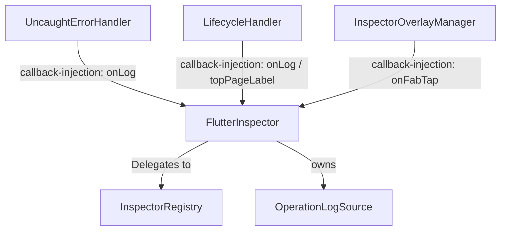

# Flutter Inspector 架構與代碼風格對比報告 (更新於 2026-08-08)

本報告以 **對照組專案**（一個大型 Flutter 電商／會員 App，採 Melos 多套件 monorepo）的工程準則與架構設計為基準，對比當前 `flutter_inspector`（下稱**當前專案**）的 `lib` 與 `example/lib` 目錄，旨在評估其代碼品味、職責拆分、命名慣例，並記錄已落地的架構調整、重構實作與核心設計權衡。

> **📌 匿名化說明**：對照組為公司內部專案，本報告一律以「**對照組**」代稱，不記錄其專案名稱、產品名稱、內部服務代號與本機路徑。所有結構描述保留技術實質（分層方式、命名慣例、依賴關係），因為本報告的價值在於**可移植的設計模式**，而非特定專案的身分。

> **📝 更新紀錄 (Changelog)**：
> * **2026-08-08（第二次修訂）**：**補做對照組實查**。前一次修訂只查了當前專案，對照組欄位是沿用舊報告的未驗證描述——經實地開啟對照組 repo 核對後，**發現舊報告對對照組的描述有多處失真**：架構實為 Melos 多套件 monorepo（非單套件三層）、`domain` 套件實際依賴 `flutter/sdk` 與具體 `data/*` 套件（非純粹依賴反轉）、命名慣例實為 `[Feature]UseCase` 介面 + `[Feature]UC` 實作（檔名 `*_uc.dart`）、錯誤處理採 Dart 3 record `(Entity?, Exception?)`。詳見 §0 與各節修訂標註。同次修訂一併將對照組相關描述匿名化。
> * **2026-08-08（第一次修訂）**：依 `lib/` 全樹（63 個 `.dart` 檔）逐一核對。**新增**四個先前完全未記載的子系統：§4 平台適配層（條件匯入 / WASM 相容）、§5 資料庫瀏覽抽象（`DatabaseBrowserSource` Strategy）、§6 書籤機制、§7 生命週期與路由名稱解析。**修正** §2 結構表對「無抽象層」的過時描述；**修正** example 評估（Demo 由 3 個增為 5 個）。**新增** §⚠️ 版本號不同步缺陷（`version.dart` 1.9.0 vs `pubspec.yaml` 2.0.0）。原「已解決的壞品味」各項經 codebase 實查確認仍成立。
> * **2026-08-01**：建立本版（上帝類別解耦、UI Tab 解耦、時序軸重構、WebView Bridge、慢速請求監控）。

---

## 0. 對照組專案實查基準（2026-08-08 新增）

> 本節記錄對照組的**實際**結構，作為後續所有對比的證據基準。來源為對照組 repo 實地讀取（非引用舊報告）；依匿名化原則，此處不記錄其路徑與專案名稱。

### 0.1 實際架構：Melos 多套件 Workspace

對照組**不是**單一套件內分三層，而是**用套件邊界強制分層**——依賴關係由 `pubspec.yaml` 的 `path` 宣告物理限制，不是靠團隊自律：

| 層級 | 套件路徑 | 職責 | 關鍵組件 |
| :--- | :--- | :--- | :--- |
| **Presentation** | `<app>/`（App 主套件） | UI 渲染與使用者操作 | Pages, Widgets, BLoCs, Models |
| **Domain** | `domain/` | 業務邏輯 | UseCase (UC), Entity |
| **Data** | `data/`（14+ 個獨立套件） | 資料來源存取 | Repo, Retrofit Service, DTO |
| **Data Layer** | `data_layer/`（4 個 repository 套件） | Repository 實作 | `*_repository` |
| **Common** | `common/` | 全局工具、常數 | Utils, Extensions |

`domain/lib/src/domains/` 底下再以**功能優先**切分（`member`、`product`、`coupon`、`search`… 共 20+ 個 domain），每個 domain 內含 `repositories/` 與 `usecase/` 子目錄。

> **🐧 這裡才是真正值得學的地方**：層級隔離不是寫在文件裡的約定，而是**編譯期的物理事實**。Presentation 想直接 import 任何一個 `data/<某某>_api` 套件，就必須先在自己的 pubspec 宣告依賴——這個動作會在 code review 時無所遁形。當前專案（單套件）沒有這道保險，只能靠紀律。

### 0.2 實際命名慣例（修正舊報告）

舊報告寫「UseCase: `[Feature]UseCase`」，**只對了一半**。實際是介面與實作分離的雙名制：

| 組件 | 實際規範 | 實際範例（實地擷取） |
| :--- | :--- | :--- |
| **UseCase 介面** | `[Feature]UseCase` | `GetPointInfoUseCase` |
| **UseCase 實作** | `[Feature]UC`，檔名 `*_uc.dart` | `GetPointInfoUC` / `get_point_info_uc.dart` |
| **Entity** | `[Feature]Entity`（308 個檔案） | `GetPointInfoEntity` |
| **Repository** | 實作 `[Feature]Repo`，檔名按**操作**而非實體切分 | `query_payment_info_repository.dart` |
| **DTO** | `[Feature]Dto`（24 個檔案） | `UserDto` |
| **UI Model** | `[Feature]Model`（73 個檔案） | `UserItemModel` |

### 0.3 實際錯誤處理：Dart 3 Record 作為錯誤通道

這是舊報告完全沒提、但**最具識別度**的設計。對照組的 UseCase 一律回傳 `(Entity?, Exception?)` record，例外不跨層傳播：

```dart
// domain/lib/src/domains/member/usecase/get_point_info_uc.dart（實地擷取）
class GetPointInfoUC implements GetPointInfoUseCase {
  final MemberApi _api;

  factory GetPointInfoUC.dio({required Dio dio}) => GetPointInfoUC(api: MemberApi(dio));
  GetPointInfoUC({required MemberApi api}) : _api = api;

  @override
  Future<(GetPointInfoEntity?, CommonException?)> handle({
    required GetPointInfoParams params,
  }) async {
    try {
      final resp = await _api.getPointInfo(ReqGetPointInfo(customerNo: params.customerNo));
      return (GetPointInfoEntity.fromDto(dto: resp), null);
    } on Exception catch (e) {
      return (null, e.handleApiException());
    }
  }
}
```

三個值得標註的設計：
* **統一入口 `handle({required Params})`**：所有 UC 同一個方法簽章，參數收斂為單一 `Params` 物件——呼叫端形狀完全一致。
* **錯誤是回傳值，不是控制流**：`(Entity?, Exception?)` 讓呼叫端無法「忘記處理錯誤」（拿到 record 就必須解構），比 `throw` 更難忽略。
* **`factory .dio()` 構造**：測試注入 mock API 與正式注入 Dio 走同一個類別的兩個入口。

### 0.4 對照組自身的規則遵守度（實查，非引述）

對照組有一份 `RULES.md` 定義工程準則。**規則是宣稱，不是證據**，因此逐條實查：

| 規則 | 實查結果 | 判讀 |
| :--- | :--- | :--- |
| Domain 層禁止 import `material.dart` | ✅ **0 處違規** | 由套件邊界 + review 雙重保障，完全守住 |
| BLoC Single State Pattern（`status` enum） | 🟡 126 / 137 檔（約 92%） | 大致守住，少數例外 |
| **嚴禁 `firstWhere`，須用 `firstWhereOrNull`** | 🔴 **20 處違規** | 純靠自律的規則，必然滲漏 |

> **🐧 這張表比任何架構圖都有價值**：同一份 RULES.md 裡的三條規則，遵守度天差地遠。差別不在於哪條比較重要，而在於**哪條有結構性保障**。「Domain 不可 import material」靠套件依賴圖擋住，所以 0 違規；「不可用 firstWhere」只是一句話，所以 20 處違規。
>
> **這正好呼應本 repo 在 [`wf-state.sh` 分析](./2026-08-21-wf-state-harness-guardrail.md) 得到的同一個結論**：寫在 Markdown 裡的規範是願望清單，寫進編譯器／腳本的規範才是保證。對照組用 pubspec 當 guardrail，`gen-dev-workflow` 用 `exit 1` 當 guardrail，是同一種品味。

---

## 🐧 核心審查與品味評級 (Linus' Taste Rating)

### 🟢 好的部分 (Good Taste)
* **工具性與純粹性**：`utils/network_formatters.dart` 等工具函數保持了 Dart 純函數 (Pure Functions) 結構，不依賴 Flutter UI 套件，這使得它們具備極高的可測試性，符合實用主義。
* **安全性默認**：在 `redactSensitiveData` 的設計上，預設為 `true` 以防敏感資訊（如 authorization token）外洩到剪貼簿，這體現了良好的「向後相容與安全默認」品味。
* **窄契約與時序軸擴展**：透過 `TimestampedEntry` 窄契約介面（`abstract interface class`）統一了日誌、網路、導航與資料庫的事件結構，並以此將時序軸的設計同時推廣至 UI 視圖（`ConsoleTab`）與 Markdown 報告導出（`DiagnosticReport`），實現了兩端設計的一致性。
* **平台差異用匯入圖消滅，而非用 `if` 消滅**（2026-08-08 新增）：`network_notifier` 與 `share_text` 皆以 `export ... if (dart.library.js_interop) ...` 的條件匯入處理 web/native 差異。這讓 `dart:io` 根本不進入 web 的匯入圖（維持 WASM 相容），而不是在執行期用 `kIsWeb` 分支繞過——**特殊情況在編譯期就消失了**，是本 repo 最具 Linus 品味的一處設計。
* **判斷與狀態更新的原子性**（2026-08-08 新增）：`AlertThrottler.shouldAlert()` 刻意把「檢查是否超過節流窗口」與「更新 `_lastAlertAt`」綁在同一次呼叫內，呼叫端不可能拿到 `true` 卻沒提交狀態。時鐘以 `DateTime Function()?` 注入，測試不需 `sleep` 即可推進時間——消滅了 flaky test 這個特殊情況。

### 🔴 已解決的壞品味與平庸部分 (Resolved Bad Taste & Flaws)

> 以下四項於 2026-08-08 經 codebase 實查**逐一驗證仍然成立**（`theme/` 目錄確為 4 個代幣檔；全 `lib/` 掃描 `_build[A-Z]` 命中數為 **0**）。

* **超級上帝類別 (God Class) 的徹底解耦**：原本 `FlutterInspector` 同時管理 core Registry、初始化、錯誤攔截與 FAB UI Overlay，違反了 **單一職責原則 (SRP)**。現已將錯誤處理與 UI Overlay 邏輯解耦至 `UncaughtErrorHandler` 與 `InspectorOverlayManager`（均位於 `lib/src/core/`），兩者完全藉由 callback 注入與 `FlutterInspector` 溝通，無任何反向依賴，使 `FlutterInspector` 收斂為極其乾淨的 Facade API。
* **UI 與業務邏輯緊密耦合 (UI Tab 解耦)**：原本各個 Tab Widget 內部充斥著大量的 `_buildXxx` 等輔助方法（Helper Methods），使得單一類別的縮排與複雜度過高。現已完全移除 `ConsoleTab`、`NetworkTab`、`NavigatorTab`、`DatabaseTab`、`TableRowsView` 內部的 Helper Methods，改以獨立的私有 Widget 類別替代，顯著降低了嵌套層次。
* **跨檔案代碼拷貝的消除**：為消除 `LogDetailView`、`NetworkDetailView` 等視圖中重複手寫的卡片與鍵值佈局，我們建立了共用 UI Widget：`DetailSection`（與 `DetailKeyValueRow`）以及 `ErrorCard`（用於錯誤與重試 UI），徹底消除了跨檔案的 UI 拷貝。
* **樣式硬編碼的消除與 Design Tokens 收攏**：原本 UI 代碼中散落了大量的 const 顏色與邊距值。我們在 `lib/src/ui/theme/` 下建立了 `theme.dart` barrel 檔案。隨後在代碼演進中，為了消除過度碎裂的代幣類別，我們進一步將 `ThemeRadius`（`theme_radius.dart`）與 `ThemeSpacing`（`theme_spacing.dart`）廢除並合併收攏至 `ThemeSize`（`theme_size.dart`），將設計代幣精簡實作為 4 個權責分明的樣式類別（`ThemeColor`、`ThemePadding`、`ThemeSize` 與 `ThemeTextStyle`），統一並簡化了視覺風格與邊距圓角的管理。

---

## ⚠️ 現存缺陷：版本號不同步（2026-08-08 實查發現）

**這不是文件落後，是程式碼的真實 bug。**

| 來源 | 值 |
| :--- | :--- |
| `pubspec.yaml` | `2.0.0` |
| `lib/src/version.dart` → `packageVersion` | `1.9.0` |

`packageVersion` 並非死代碼，它有兩個對外可見的消費端：

1. `FlutterInspector.version`（`flutter_inspector.dart:29`）—— 公開 API，宿主 App 可直接讀取。
2. `DiagnosticReport`（`diagnostic_report.dart:68`）—— **每一份使用者導出的診斷報告表頭都會印上這個版本號**。

也就是說，目前所有導出的報告都會宣稱自己來自 `1.9.0`，而實際套件是 `2.0.0`。當使用者回報問題並附上報告時，版本資訊會直接誤導排查方向。

> **🐧 Linus 評註**：這是典型的「同一個事實存在兩份手動維護的副本」——資料結構層面的錯誤，而非疏忽。發布流程要求人記得同步四個地方，那麼漏掉就只是時間問題。**根治方向是讓 `pubspec.yaml` 成為唯一真實來源**（建置期生成 `version.dart`），而不是在 checklist 上再加一行「記得改」。在根治前，`gen-update-publish-info` 流程必須顯式涵蓋 `lib/src/version.dart`。

---

## 🔍 架構與職責對比分析

### 1. 專案結構 (Structure)

| 維度 | 對照組專案（2026-08-08 實查修正） | 當前專案 (flutter_inspector) |
| :--- | :--- | :--- |
| **架構模式** | **Melos 多套件 monorepo**（非單套件三層）。20+ 個 `pubspec.yaml`，分層由套件邊界物理隔離 | **扁平技術分包** (Technical Grouping)，單一套件、14 個 `lib/src/` 子目錄、63 個 `.dart` 檔 |
| **層級隔離** | `Presentation` → `Domain` → `Data`，**由 pubspec `path` 依賴強制**。想穿透必須先宣告依賴，藏不住 | 混雜在單一 package 下，`ui` 直接呼叫底層 models 與核心 core，藉由 `FlutterInspector` Facade 進行互動。**無編譯期保障，靠紀律** |
| **內部組織** | Domain 內**功能優先**：`domains/member`、`domains/product`… 20+ 個，各含 `usecase/` 與 `repositories/` | **技術優先**：`core/`、`models/`、`ui/`、`utils/`、`inspectors/`… |
| **業務邏輯位置** | 封裝在 `domain/` 的 UC 中。⚠️ **實查修正**：`domain/pubspec.yaml` 確實依賴 `flutter/sdk` 與 `dio`，並直接 path-依賴具體 `data/*` 套件——**並非教科書式的依賴反轉**，但確實 0 處 import `material.dart`（UI 汙染守得住） | 寫在 UI 的 `StatefulWidget` 狀態更新或 `network_utils.dart` 等純函數中。 |
| **實體隔離** | 三層各自轉換：`Dto`(24) → `Entity`(308) → `Model`(73)，以 `Entity.fromDto()` 銜接 | 統一使用 `Entry`（如 `NetworkEntry`），並實作 `TimestampedEntry` 契約。**刻意不做三重轉換** |
| **錯誤處理** | Dart 3 record `(Entity?, Exception?)` 作為回傳值，例外不跨層傳播（見 §0.3） | `try-catch` + 邊界防護（WebView 256KB 上限、`ArgumentError` 參數驗證） |
| **抽象層的使用** | 外部服務（Repo/Service）**一律**要有抽象介面（RULES.md 明文） | **並非全無抽象**：在「有多個實作」的真實需求處才引入介面——`DatabaseBrowserSource`（多資料來源）、`NetworkNotifier`（平台差異）、`TimestampedEntry`（多事件型別）。**沒有單一實作的介面** |

> **Linus 實用主義評註**：雖然扁平技術分包缺乏嚴格的層級邊界，但對於輕量型的 Debug Tool Package 而言，這是一種「剛剛好」的實用設計。只要我們嚴格維持 core 協作器的單向依賴（Facade 模式）並將純計算邏輯抽離為純函數，就無需為了應對臆想中的複雜度而引入沉重的 Usecase 或 Repository 層。
>
> **值得特別標註的紀律**：本專案引入抽象的判準始終是「**現在就有 ≥2 個實作**」，而非「未來可能會有」。`DatabaseBrowserSource` 有內建與使用者註冊兩類來源、`NetworkNotifier` 有 io/web 兩個實作——都是真實存在的多型需求。這正是「不為臆想威脅付出複雜度」的具體落地。

### 2. 狀態管理與職責 (State Management & Responsibilities)

* **對照組專案**（2026-08-08 實查佐證）：UI 僅負責 Layout 聲明，商業邏輯與過濾交給 `flutter_bloc` ^9.1.1——實查 **135 個 `*_bloc.dart`、僅 1 個 `*_cubit.dart`**，選型高度一致不混用。搭配 `get_it` ^8.0.3 做 DI、`go_router` 導航。規範要求 Single State Pattern（單一 State 類別 + `status` enum + `Equatable`），實查遵守度 126/137（約 92%）。
* **當前專案**：UI 層（例如 `NetworkTab`、`ConsoleTab`）的 `StatefulWidget` 直接持有 filter 狀態，並在 `build` 方法中同步呼叫 `applyNetworkFilter` 或 `mergedTimeline` 執行資料過濾與狀態生成。**無任何狀態管理套件依賴**。
* **權衡與決策**：
  * 當前專案並未引入額外的 `NetworkController` 或 `ChangeNotifier`。
  * **原因**：核心緩衝區使用 `RingBuffer` 實現，其最大容量鎖定在 `bufferSize = 500`（或相似規模）。所有過濾操作皆為記憶體內運行的純函數，執行耗時在微秒（$\mu s$）級別，不會對 UI 幀率構成威脅。
  * 若強行引入 Controller 層，會增加至少一個類別定義、額外的 `ListenableBuilder` 嵌套以及生命週期銷毀（`dispose`）的代碼，違反了 **YAGNI (You Aren't Gonna Need It)** 與 Ponytail 最小化原則。因此，**保留 build 內部的同步過濾，同時重構 Widget 類別以降低 UI 代碼複雜度** 是最具品味的折衷方案。

### 3. 命名慣例 (Naming)

* **對照組專案**（2026-08-08 依實際檔案修正，詳見 §0.2）：
  * UseCase: **介面 `[Feature]UseCase` + 實作 `[Feature]UC`**（檔名 `*_uc.dart`）——舊報告漏記了實作端的 `UC` 後綴
  * Entity: `[Feature]Entity`（308 檔）｜ DTO: `[Feature]Dto`（24 檔）｜ UI Model: `[Feature]Model`（73 檔）
  * Repository: 實作 `[Feature]Repo`，且**檔案按操作切分**（`query_payment_info_repository.dart`、`update_payment_info_repository.dart`），而非一個實體一個 repo
* **當前專案**：
  * 依然保持 `Entry`（如 `NetworkEntry`、`LogEntry`）的命名，以防止破壞外部使用者的調用介面（**Never break userspace**）。
  * 引入 `TimestampedEntry` 作為窄契約介面（`abstract interface class`），為所有需要加入時序軸的事件物件提供統一的 `timestamp` 排序鍵，並藉由 `TimestampedEntryDisplay` extension 提供 DRY（Don't Repeat Yourself）的 `displayTime` 統一格式。

---

## 🛠️ Linus 式解耦設計與實作落地

### 1. 上帝類別 (God Class) 徹底解耦

為使 `FlutterInspector` 回歸為乾淨的 Facade API，我們將「錯誤鉤子掛載」與「FAB 懸浮按鈕生命週期管理」這兩個與核心 Registry 無關的職責徹底抽離。



* **`UncaughtErrorHandler` (`lib/src/core/uncaught_error_handler.dart`)**：
  * **職責**：集中註冊與串接 Flutter 架構的三個標準錯誤鉤子（`FlutterError.onError`、`PlatformDispatcher.instance.onError` 與 `ErrorWidget.builder`）。同一次 build 崩潰經 `onError` 與 `ErrorWidget.builder` 會收到同一個 `FlutterErrorDetails`，`_logFlutterError` 以 object-identity 去重，避免 Console 重複記錄（PR #96）。
  * **解耦機制**：透過 `LogCallback` 構造函數注入 `onLog` 回呼函數。其內部完全沒有導入或依賴 `FlutterInspector`。
* **`InspectorOverlayManager` (`lib/src/core/inspector_overlay_manager.dart`)**：
  * **職責**：管理 `InspectorFab` 懸浮按鈕的 Overlay 生命週期（`attach`、`detach`）。
  * **解耦機制**：透過 `onFabTap` 構造函數注入。同樣地，該管理器對 `FlutterInspector` 具有 **零反向依賴**。
* **Facade API 收斂**：
  * 重構後的 `FlutterInspector`（389 行）僅在建構時將自身的 `log` 方法與 `openDashboard` 方法以 callback 形式傳遞給上述管理器。其自身的代碼收斂為簡潔的屬性轉發與 Registry 接線，職責非常純粹。
  * **建構參數全表**（2026-08-08 補全）：`customTab`、`customTabTitle`、`magicalTapCount`、`showNetworkNotification`、`navigatorKey`、`captureUncaughtErrors`、`captureLifecycleEvents`、`redactSensitiveData`、`diagnosticInfoSource`、`slowRequestThreshold`。其中 `showNetworkNotification`、`captureUncaughtErrors`、`captureLifecycleEvents` **一律預設 `false`**——具有副作用或需要權限的能力採 opt-in，是良好的安全默認。

### 2. UI Tab 解耦與元件提取

我們消滅了各個 UI 視圖中的輔助方法（Helper Methods），並將它們改寫為獨立的 Widget 類別以增進效能與可讀性：

* **Helper Methods 的消除**：
  * **ConsoleTab**：移除 `_buildRow` 等 5 個 Helper Methods，改為 `_EntryRowDispatcher` 與 4 個對應 Entry 類別的私有 Row Widget（如 `_LogEntryRow`）。
  * **NetworkTab**：移除 Helper Methods，解耦為獨立 Widget：`_SearchBar`、`_FilterChips` 與 `_EntryTile`；同時新增慢速請求視覺標記 `🐢 SLOW`（當 `duration >= slowRequestThreshold` 時於 `_EntryTile` 尾部顯示）以及 `_ErrorSummaryBanner` 頂部動態摘要統計資訊。
  * **NavigatorTab**：解耦出 `_ActiveStackView` 與 `_CurrentBadge`。
  * **DatabaseTab & TableRowsView**：將主體佈局分別解耦為 `_DatabaseTabBody` 與 `_TableRowsBody`，並抽離出 `_CellDetailsBottomSheet` 與 `_StatusBar`。
* **共用元件提取**：
  * 提取 `lib/src/ui/widgets/detail_section.dart`（包含 `DetailSection` 與 `DetailKeyValueRow`），供 `LogDetailView` 與 `NetworkDetailView` 統一呼叫，徹底消除了跨檔案的 Key-Value 佈局拷貝。
  * 提取 `lib/src/ui/widgets/error_card.dart`（提供 `ErrorCard`），統一了 `DatabaseTab` 與 `TableRowsView` 載入失敗時的錯誤與重試 UI 呈現。
  * 另有 `key_value_table.dart` 與 `magical_tap.dart`（喚起 Dashboard 的多次點擊手勢偵測，次數由 `magicalTapCount` 配置）。

### 3. 時序軸重構 (Timeline Redesign)

* **排序契約與格式統一**：
  * `TimestampedEntry` 定義為 `abstract interface class`，強制衍生類別只能 `implements` 以鎖死契約。
  * 提供 `TimestampedEntryDisplay` extension，統一導出 `HH:mm:ss.mmm` 格式的 `displayTime`。
* **`DiagnosticReport` (`lib/src/utils/diagnostic_report.dart`) 整合**：
  * 診斷報告導出的 `Logs` 區段現已替換為按時間降序排列的 Chronological mixed `Timeline` Markdown 表格。
  * `errorsOnly` 過濾開關套用至整個時序軸串流（僅保留錯誤/警告日誌，以及 `statusCode >= 400` 或帶有 transport 錯誤的網絡請求；無錯誤語意的導航與資料庫事件則被濾除），確保了在 UI 端與報告導出端邏輯的一致。

### 4. 平台適配層：條件匯入與 WASM 相容（2026-08-08 新增）

本專案處理平台差異的手法值得單獨標註，因為它**在編譯期消滅特殊情況**，而非在執行期分支：

```dart
// lib/src/notifications/network_notifier.dart
export 'network_notifier_io.dart'
    if (dart.library.js_interop) 'network_notifier_web.dart';
```

* **涵蓋範圍**：`notifications/network_notifier.dart`（通知）與 `utils/share_text.dart`（分享/剪貼簿）兩處。
* **設計動機**：讓 `dart:io` 與 `flutter_local_notifications` **根本不進入 web 的匯入圖**，保持套件的 WASM 相容性。若改用執行期 `kIsWeb` 判斷，`dart:io` 仍會被靜態分析納入依賴圖而破壞 WASM 建置。
* **行為誠實性**：web 版 `network_notifier_web.dart`（31 行）是明確的 no-op stub。原始碼註解明白寫出「web 從未顯示過通知」——**不假裝支援，也不靜默失敗**，這是對既有行為的誠實記錄。
* **檔案規模**：io 實作 210 行、web stub 31 行、契約 11 行。

### 5. 資料庫瀏覽的 Strategy 抽象（2026-08-08 新增）

`DatabaseBrowserSource`（`lib/src/models/database_browser_source.dart`）是本專案少數幾個真正的多型介面，定義三個成員：`name`、`listTables()`、`fetchRows()`。

* **內建實作 `OperationLogSource`**（`lib/src/sources/operation_log_source.dart`，82 行）：把 `DatabaseInspector` 的操作日誌**偽裝成虛擬資料表**呈現。它掃描所有 entry 的 `data` keys 聯集動態決定欄位，並固定前置 `#time` / `#op` / `#rows` 三個中繼欄位。
* **使用者擴充點**：`FlutterInspector.registerDatabaseSource()` 讓宿主 App 註冊自己的真實資料庫（如 sqlite、ObjectBox），UI 端不需要任何改動即可瀏覽。
* **🐧 品味評註**：這是「把特殊情況變成正常情況」的教科書案例——**操作日誌本身不是資料庫，卻被包裝成資料庫來源**，於是 `DatabaseTab` 不需要寫「如果沒有註冊真實資料庫就改顯示日誌」這種分支。UI 永遠只面對一個統一的 source 列表。
* **穩定性細節**：`fetchRows` 掃描欄位時刻意以 `oldestFirst` 順序走訪，確保欄位順序在分頁之間保持穩定，不會因為翻頁而跳動。

### 6. 書籤機制 (Bookmarks)（2026-08-08 新增）

`FlutterInspector` 提供一組書籤 API，讓開發者在大量事件中標記關注項：

| 成員 | 說明 |
| :--- | :--- |
| `bookmarkedEntries` | 回傳 `Set.unmodifiable(...)`，防止外部竄改內部狀態 |
| `isBookmarked(entry)` | 查詢 |
| `toggleBookmark(entry)` | 切換 |
| `clearBookmarks()` | 全清 |

* **資料結構選擇**：內部為 `Set<TimestampedEntry>`。由於 Entry 類別未覆寫 `operator ==`，`Set` 實際採用 **object identity** 語意——書籤綁定的是「那一個具體事件物件」，而非「內容相同的任何事件」。這對除錯工具而言是正確語意（兩筆內容相同的請求應可各自獨立標記）。
* **消費端**：`ConsoleTab`（UI 標記）、`export_report_sheet.dart` 與 `diagnostic_report.dart`（導出時可僅輸出書籤項）。
* **⚠️ 已知邊界**：`RingBuffer` 容量上限為 500，舊 entry 被擠出緩衝區後，其書籤仍留在 `_bookmarkedEntries` 中，形成無法從 UI 回溯的孤兒引用（同時阻止該物件被 GC）。以除錯工具的使用時長而言影響有限，但屬於**真實存在的記憶體滯留**，值得列入後續觀察。

### 7. 生命週期與路由名稱解析（2026-08-08 新增）

* **`LifecycleHandler` (`lib/src/core/lifecycle_handler.dart`，61 行)**：以 `WidgetsBindingObserver` 記錄 App 前後景切換為 `LogLevel.info` 日誌。
  * **不破壞宿主**：原始碼註解明確指出 Flutter 以 list 保存 observers，因此掛載本 handler **不影響宿主 App 自己的 observer**——這正是「Never break userspace」的具體實踐。
  * **解耦一致性**：同樣採 callback 注入（`onLog`、`topPageLabel`），與 `UncaughtErrorHandler` 完全同構。
  * **誠實的降級**：`topPageLabel` 回傳 `null` 時（無法解析頂層頁面），日誌訊息就省略該後綴，**不編造頁面名稱**。
* **`inspector_route_names.dart` / `navigator_stack_resolver.dart`**：負責把 Flutter 的 Route 物件解析為可讀名稱，並在歷史為空時做 best-effort replay。

### 8. WebView Bridge 架構解耦與防禦性設計

* **Adapter Pattern (翻譯器非系統)**：JS Bridge 被實作為「翻譯器 (Adapter)」而非全新子系統，負責將 Web 端輸入直接映射為既有的 `LogEntry` 與 `NetworkEntry`，保持既有時序軸與資料庫設計的純潔性。
* **Provenance Metadata (來源溯源)**：引入 `NetworkOrigin` 列舉與 `pageUrl` 屬性明確標記事件發源地，徹底廢棄過去依賴 `sourceDio == null` 這類隱含狀態（易受 `WeakReference` GC 影響而失真）的脆弱檢查。
* **Hostile Input Hardening (敵意輸入防護)**：將 WebView payload 視為不可信輸入——JS 端字串長度截斷（MAX_CHARS）、Dart 端 256KB 解碼上限，確保 Flutter UI Isolate 不會因惡意 payload 而 OOM 或崩潰。

### 9. 網路請求慢回應監控與視覺標示 (Slow Request Feature)

* **門檻配置與防禦性驗證**：`slowRequestThreshold` 預設 `const Duration(seconds: 2)`；若 `isNegative` 則拋出 `ArgumentError.value(...)`。
* **UI 列表慢速標籤**：`duration != null && duration! >= slowRequestThreshold` 時，於 `NetworkTab`（`_EntryTile`）與 `ConsoleTab`（`_NetworkEntryRow`）顯示橘色 (`ThemeColor.colorFF9800`) **`🐢 SLOW`** Badge。
* **頂部儀表板動態統計 (`_ErrorSummaryBanner`)**：無錯誤但有慢速時提示 `🐢 Z slow requests (>Ns)`；兩者皆有時呈現 `⚠ X errors (Y types) | 🐢 Z slow (>Ns)`。

---

## 📋 範例專案 (example/lib) 評估與現況驗證

2026-08-08 重新實查，前兩項結論不變，第 2 項數量需更正：

1. **全域變數污染依舊存在**（實查確認，`example/lib/main.dart:13-14`）：
   ```dart
   late final FlutterInspector inspector;
   final GlobalKey<NavigatorState> navigatorKey = GlobalKey<NavigatorState>();
   ```
2. **Demo 物件生命週期繫結**（**數量更正：3 → 5**）：
   `NetworkDemo`、`SqliteDemo`、`ObjectBoxDemo`、`WebViewDemo`、`InAppWebViewDemo` 皆直接實例化在 `_MyHomePageState` 的 `initState()` 中（`main.dart:87-91`），生命週期與此單一頁面的 State 緊密綁定。
3. **現況驗證結論**：
   此結論依舊成立。對於單純的範例 App，使用全域變數與直接實例化符合**實用主義**，不引入額外的依賴注入框架（如 `GetIt`）可保持範例的極簡性。然而，在大型生產環境的宿主 App 中，強烈建議使用依賴注入（如 `get_it`）或狀態管理套件（如 `Provider`/`Riverpod`）來注入與管理 `FlutterInspector` 的生命週期，以防範全域變數初始化順序不當或記憶體外洩的風險。
   > 但需注意：Demo 數量從 3 增至 5，`initState` 的初始化區塊正在線性膨脹。**這是「範例 App 開始長成真 App」的早期訊號**——若再增加，建議改為 lazy 建立或以 map 註冊，避免 `initState` 變成另一個上帝方法。

---

## ⚖️ 架構權衡與折衷 (Architectural Trade-offs)

### 診斷報告中的時序軸與細節區段之冗餘 (Redundancy vs Completeness)

在 `DiagnosticReport` 的 `buildDiagnosticReport` 實作中，報告內同時包含 mixed Chronological Timeline 表格，以及下方獨立的 Network、Navigation、Database 詳細事件區段。折衷如下：

* **冗餘性 (Redundancy)**：同一個網路請求或資料庫操作，既會以一行出現在頂部 Timeline，也會在下方詳細區段完整輸出，導致 Markdown 報告存在重複內容。
* **完整性 (Completeness)**：
  * 時序軸旨在呈現 **因果鏈 (Causality)**：例外發生時，開發者需一眼看出前後幾秒內的資料庫操作、HTTP 請求或頁面切換。
  * 詳細區段旨在提供 **排查依據 (Diagnostic Payload)**：看到 Timeline 中某請求失敗時，需查看完整 JSON Response、Request Header 或 SQL 語句。
* **決策**：為保證生產環境排查問題的上下文完整度，這種**結構化冗餘是高度實用且必要的**。比起縮減報告大小，我們更重視「排查問題時不遺漏任何足跡」。

### 對照組值得借鏡與刻意不借鏡的部分（2026-08-08 新增）

實查對照組後，逐項判斷「該不該搬」——**照抄大型 App 的架構到 debug 工具套件上是最典型的過度工程**，因此拒絕的理由必須和採納的理由一樣明確。

| 對照組做法 | 是否借鏡 | 理由 |
| :--- | :--- | :--- |
| **UseCase 統一 `handle({required Params})` 簽章** | ❌ 不借鏡 | 當前專案沒有 UseCase 層，硬造一層來套簽章是為了對稱而對稱 |
| **`(Entity?, Exception?)` record 錯誤通道** | 🟡 **局部值得考慮** | 本 repo 的 `DatabaseBrowserSource.fetchRows()` 目前靠 `try-catch` + `ErrorCard` 呈現失敗。改成 record 可讓「載入失敗」成為型別的一部分、呼叫端無法忽略。但只有 2 個實作，收益有限——**列為觀察，不急著改** |
| **套件邊界強制分層** | ❌ 不借鏡 | 63 個檔案的 debug 工具拆成 5 個 pubspec，維護成本遠大於收益。單套件 + Facade 已足夠 |
| **Dto → Entity → Model 三重轉換** | ❌ 明確拒絕 | 這是為了隔離「後端 API 變動」而付的稅。本 repo 的 `Entry` 是自己定義的資料結構、沒有外部 API 契約要隔離，三重轉換會是純粹的樣板碼 |
| **`firstWhereOrNull` 取代 `firstWhere`** | ✅ **值得採納** | 這條與專案規模無關，是純粹的正確性問題（`firstWhere` 找不到就拋例外）。且對照組實查有 **20 處違規**正說明「光寫規則沒用」——若要採納就該進 `analysis_options.yaml` 當 lint 規則，而非寫進文件 |
| **Domain 層禁 `material.dart`** | ✅ **精神已落地** | 當前專案的 `utils/*_formatters.dart` 已維持純 Dart。可考慮以 lint 明文化 |

> **🐧 總結判準**：對照組的價值不在於「它的架構比較完整所以要模仿」，而在於**它示範了哪些規則能被結構強制、哪些不能**。值得搬的是後者的教訓（把規則寫進 lint / 編譯期），不是前者的形式（分層與轉換）。

### 書籤與 RingBuffer 的生命週期落差（2026-08-08 新增）

如 §6 所述，書籤集合的生命週期長於 `RingBuffer` 中的 entry。這是「保留使用者明確標記的意圖」與「限制記憶體用量」之間的取捨：

* **維持現狀的理由**：使用者主動標記代表該事件重要，因緩衝區輪替而靜默丟棄書籤會違反使用者預期；且除錯工具的 session 通常短暫，滯留量有限。
* **需要處理的訊號**：若未來 `bufferSize` 提高、或工具被用於長時間執行的場景，孤兒書籤的記憶體滯留就會從「可忽略」變成「真實洩漏」。屆時的正解是讓書籤與 buffer 輪替連動（或改存輕量 key 而非物件引用），而非放任其增長。
