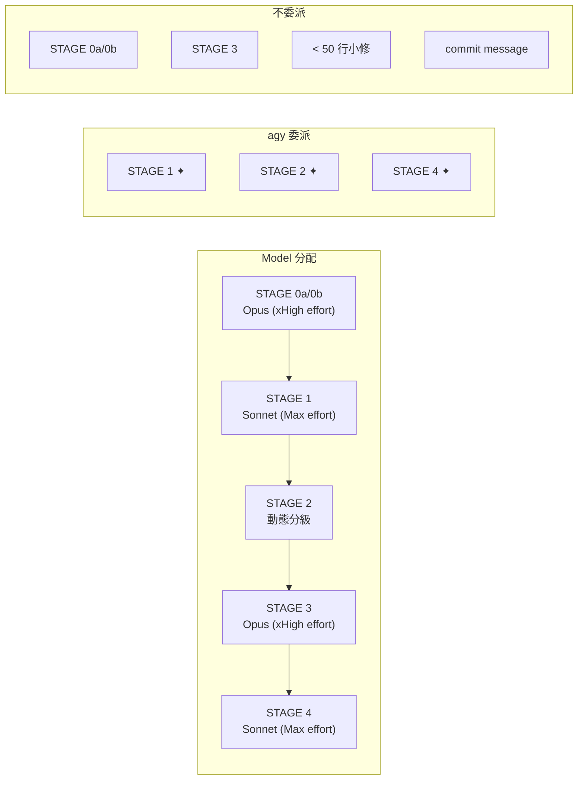

# gen-dev-workflow 全階段分析報告

## 總覽

`gen-dev-workflow` 是一個**全自動開發流程編排器**，從使用者說「幫我做 X 功能」到 PR 建立，共 6 個 stage（0a → 0b → 1 → 2 → 3 → 4），外加獨立入口的 STAGE 5。核心機制是 **Claude 做總指揮 + `agy` CLI 做委派執行**。

---

## 各階段詳細分析

### STAGE 0a：功能規格（What & Why）

| 項目 | 內容 |
|------|------|
| **Agent** | planner |
| **Model** | Opus (xHigh effort)（最強推論） |
| **委派** | 無 agy 委派，Claude 親自執行 |
| **並行** | 🟢 並行 2 條線：A. 專案 context 收集（讀檔 / git log）B. 相似功能代碼調查 |
| **產出** | `docs/features/YYYY-MM-DD-<feature>.md`（使用者故事、驗收條件、範圍邊界） |
| **暫停點** | ⏸ 展示規格 → 等使用者確認 |

**執行工作：**
1. 接收使用者需求描述
2. 並行啟動兩個研究任務（唯讀，不寫檔）
3. 收斂研究結果，撰寫功能規格文件
4. 暫停等待確認

---

### STAGE 0b：實作計畫（How）

| 項目 | 內容 |
|------|------|
| **Agent** | planner |
| **Model** | Opus (xHigh effort) |
| **委派** | 無 agy 委派 |
| **並行** | 無 |
| **產出** | `docs/plans/YYYY-MM-DD-<feature>.md`（資料結構、檔案異動、任務拆分 + 複雜度標註） |
| **暫停點** | ⏸ 展示計畫 → 等使用者確認 |

**執行工作：**
1. 讀取 STAGE 0a 確認後的功能規格
2. 分析 codebase 結構
3. 拆分任務、標註複雜度等級（供 STAGE 2 model 選擇用）
4. 撰寫實作計畫文件
5. 暫停等待確認

---

### STAGE 1：建立分支

| 項目 | 內容 |
|------|------|
| **Agent** | brancher |
| **Model** | Sonnet (Max effort)（純 IO，不需強推論） |
| **委派** | ✦ agy 執行 `gh issue create` + `git checkout` |
| **並行** | 無 |
| **產出** | GitHub Issue + Git 分支 |
| **暫停點** | ⏸ 展示 Issue 標題/內容 + 分支名稱 → 等使用者確認或修改 |

**執行工作：**
1. 根據計畫草擬 Issue 標題與描述
2. 草擬分支命名
3. 暫停讓使用者確認/修改
4. 確認後委派 agy 執行 CLI 指令

---

### STAGE 2：實作（核心 Stage）

| 項目 | 內容 |
|------|------|
| **Agent** | implementer |
| **Model** | **動態分級**（見下表） |
| **委派** | ✦ agy 負責代碼 + 測試 + commit；Claude 做兩階段驗收 |
| **並行** | 🟢 條件式並行（≥2 獨立任務且寫入路徑不重疊） |
| **產出** | 實作代碼 + 測試 + commits |
| **暫停點** | ⏸ 每個任務/每批並行完成後展示變更 + 測試結果 → 等確認 |

**Model 動態分級（STAGE 2 內部）：**

| 任務複雜度 | Model 選擇 | 範例 |
|-----------|-----------|------|
| 觸及 1–2 檔、規格完整、機械性 | 快/便宜 model（如 Haiku） | 新增 DTO 欄位、補 util function |
| 觸及多檔、需整合協調 | 標準 model（如 Sonnet (Max effort)） | 跨 service 串接、改既有流程 |
| 需設計判斷或廣泛 codebase 理解 | 最強 model（如 Opus (xHigh effort)） | 重構狀態機、新增跨層架構 |

**執行工作：**
1. 解析實作計畫，判斷並行/序列模式
2. 逐任務（或並行批次）分派給 agy
3. Claude 做兩階段驗收：spec compliance → code quality
4. 每個任務完成後暫停展示結果
5. 失敗時進入 retry 迴圈（最多 2 次重派）

**並行契約（三規則）：**
1. 每個並行單元有明確寫入檔案清單
2. 共享資源（pubspec.yaml、DI 註冊等）只能有一個 owner
3. 結果聚合 + 失敗短路機制

---

### STAGE 3：審查

| 項目 | 內容 |
|------|------|
| **Agent** | reviewer |
| **Model** | Opus (xHigh effort)（根因判斷需最強推論） |
| **委派** | **不委派 agy**（審查不可外包） |
| **並行** | 無 |
| **產出** | 審查報告 |
| **暫停點** | ⏸ 展示報告 → 通過則進 STAGE 4，不通過則退回 STAGE 2 |

**執行工作：**
1. reviewer agent 親自審查所有變更
2. 產出審查報告
3. 不通過 → 退回 STAGE 2 修正 → 再回 STAGE 3（迴圈）

**設計考量：** Opus (xHigh effort) 做審查是為了避免「自己審自己」（implementer 可能用 Sonnet (Max effort)/Haiku，reviewer 刻意用不同源的 Opus (xHigh effort) 來交叉驗證）。

---

### STAGE 4：發布

| 項目 | 內容 |
|------|------|
| **Agent** | publisher |
| **Model** | Sonnet (Max effort) |
| **委派** | ✦ agy 分析 Diff → 產 PR 草稿；Claude 校對 |
| **並行** | 無 |
| **產出** | GitHub PR |
| **暫停點** | ⏸ 展示 PR 草稿 → 等使用者確認發布 |

**執行工作：**
1. agy 分析 branch diff，生成 PR 描述草稿
2. Claude 校對草稿品質
3. 暫停讓使用者確認
4. 確認後發布 PR

---

### STAGE 5：回覆 PR Review（獨立入口）

| 項目 | 內容 |
|------|------|
| **Agent** | responder → reviewer → publisher |
| **Model** | Sonnet (Max effort)（responder）→ Opus (xHigh effort)（reviewer）→ Sonnet (Max effort)（publisher） |
| **委派** | 無 agy 委派 |
| **並行** | 無 |
| **觸發** | 使用者說「PR #42 有新的 review 意見」 |

**執行工作：**
1. responder 逐條處理 PR review 意見
2. reviewer 重新審查修改
3. publisher 更新 PR

---

## Model 與委派策略總覽



### 不委派 agy 的硬規則
- commit message（直接依 diff 生成，省一次 context 來回）
- 單一檔案 < 50 行的小修正
- STAGE 3 審查報告（reviewer 親自判斷）

---

## 狀態持久化與 Token Budget Gate

### 狀態檔：每個 workflow 一個檔（per-branch）

state 不是單一檔，而是 `.claude/workflow-state/` 目錄下**每個 workflow 一個檔**：

```
.claude/workflow-state/<branch-slug>.json      ← 已建 branch 的 workflow（STAGE 1 之後）
.claude/workflow-state/.pending-<wf-id>.json   ← 尚無 branch 時的暫存（STAGE 0a / 0b）
```

- 每個 stage 完成後寫入對應 workflow 的檔
- 支援 `sequence`（完整流程）和 `jump`（跳入特定 stage）兩種模式
- 記錄 `interrupted_by` 欄位追蹤中斷原因
- 記錄 `workflow_id`（`wf-<epoch>-<rand4>`）作為 pending 階段的唯一識別

### 多 workflow 並行（隔離設計）

**隔離 key = git branch。** 同一 repo 可同時跑多個獨立 workflow（多終端 / 多 session），各自跑在不同 branch、寫不同 state 檔，彼此天然零衝突——不需要鎖、不需要中央索引。

唯一邊界是「兩個流程都還在 STAGE 0a/0b（尚無 branch）」這個短暫窗口。此時 branch 推導不出唯一檔，改靠 **workflow-id 持久化**識別：

| 機制 | 解決的問題 |
|------|-----------|
| `workflow_id` 寫進 `.pending-<wf-id>.json` 內容 | session 中斷後，pending 檔不再是無主孤兒，可被精準認領 |
| 進度行帶 `[<wf-id>]` / `[<branch-slug>]` 前綴 | 多個並行流程的輸出一眼可辨 |
| 狀態定位「先認 wf-id、再認 branch」 | 不再用 `git branch --show-current` 誤撿別人的 pending 檔 |

### Token Budget Gate

| Context 用量 | 行為 |
|---|---|
| < 60k | 正常流程 |
| 60–100k | ⚠️ 提示精簡，委派 agent 只回摘要 |
| 100–150k | ⚠️ 強制走委派路徑，主對話只保留高層判斷 |
| > 150k | ⛔ 強制 checkpoint，主動切 session |

**閉環機制：** 超標時完成當前最小單元 → 寫入 state → commit 未存變更 → 告知使用者 → 新 session 自動續接。

---

## 優缺點分析

### ✅ 優點

| 面向 | 優點 | 說明 |
|------|------|------|
| **架構完整性** | 端到端覆蓋 | 從需求到 PR 全流程自動化，6 個 stage 涵蓋 SDLC 核心環節 |
| **成本優化** | Model 動態分級 | 不是所有任務都用 Opus，機械性工作用便宜 model，真正降成本 |
| **品質保障** | 交叉審查 | implementer 和 reviewer 刻意用不同 model，避免「自己審自己」 |
| **韌性** | Token Budget Gate 閉環 | 長流程不會因 context 爆炸而丟失進度，state 持久化是真正的救生圈 |
| **可恢復性** | per-branch state 檔 | session 中斷後可續接，`interrupted_by` 區分主動離開 vs 系統保護 |
| **多流程並行** | per-branch 隔離 + workflow-id | 同 repo 可同時跑多個 workflow，branch 為隔離 key 達成零鎖並行；pending 階段靠 workflow-id 持久化補上唯一缺口 |
| **並行效率** | 條件式並行 + 三規則契約 | 不盲目並行，有明確的衝突偵測和失敗處理策略 |
| **人在迴路** | 關鍵暫停點 | 規格、計畫、分支、每個任務、審查、PR 都有確認點，不會脫韁 |
| **靈活入口** | Quick Commands + jump mode | 可以從任意 stage 切入，不強迫跑完整流程 |
| **退回機制** | STAGE 3 → STAGE 2 迴圈 | 審查不通過不是死路，有明確的退回路徑 |
| **失敗處理** | 分級 retry + 人工兜底 | 重試有上限（2 次），超過就停下來問人，不無限迴圈 |

### ❌ 缺點

| 面向 | 缺點 | 嚴重度 | 說明 |
|------|------|--------|------|
| **過度工程** | 小功能走全流程太重 | 🔴 高 | 一個 10 行的 bug fix 也要跑 0a → 0b → 1 → 2 → 3 → 4？六個 stage 加上多次暫停確認，可能花 30 分鐘在流程上，3 分鐘在寫 code 上。沒有「輕量模式」的逃生艙 |
| **暫停點過多** | Human-in-the-loop 頻率太高 | 🟡 中 | 光是正常流程就有 7 個暫停點，使用者必須一直盯著等確認。「自動驅動」的承諾被密集的確認打斷，特別是 STAGE 2 每個任務都暫停 |
| **agy 依賴** | 外部 CLI 是單點故障 | 🟡 中 | 雖說有 fallback，但 `agy` 不在 PATH 時的 fallback 行為描述模糊——「功能仍可運作但不會委派」到底怎麼運作？哪些 stage 受影響？ |
| **Model 假設** | 綁定 Anthropic 模型族 | 🟡 中 | Opus / Sonnet / Haiku 是 Claude 系列的專有名稱。如果使用者用 GPT-4 或 Gemini，整套 model 分級策略就不適用。文件沒有 model-agnostic 的 fallback |
| **狀態檔脆弱** | JSON 手動管理無校驗 | 🟡 中 | per-branch state 檔仍是 LLM 手寫 JSON，沒有 schema validation、沒有版本號、沒有 checksum。手動編輯或 stage 寫入半途中斷就會腐壞，下次續接時可能靜默出錯。（workflow-id 持久化已解決「pending 檔無主孤兒」這一子問題，但 JSON 本身的完整性校驗仍缺） |
| **並行複雜度** | 契約規則難以程式化驗證 | 🟡 中 | 「寫入路徑不重疊」「共享資源指定唯一 owner」靠 planner 在計畫中標好——但 planner 本身是 LLM，標錯怎麼辦？沒有靜態檢查機制 |
| **Context 估算** | Token 用量無法精確測量 | 🟡 中 | Token Budget Gate 依賴「評估主對話 context 用量」，但 LLM 無法精確知道自己的 context 用了多少 token。60k / 100k / 150k 的閾值在實務上只能靠啟發式猜測 |
| **缺乏回滾** | 沒有 undo/rollback 機制 | 🟡 中 | STAGE 2 如果 implementer 寫了爛 code 且已 commit，STAGE 3 退回 STAGE 2 只是「重做」，不會自動 `git revert`。壞 commit 會留在歷史中 |
| **STAGE 5 脫節** | 與主流程不連貫 | 🟡 低 | STAGE 5 是「獨立入口」，但它串聯了 responder → reviewer → publisher 三個 agent，邏輯與主流程部分重疊卻又獨立。如果 STAGE 5 的修改引入新 bug，沒有機制退回 STAGE 2 |
| **文件 vs 執行** | Skill 是文件，不是程式 | 🔴 高 | 整個 workflow 是 markdown 指令文件，靠 LLM「讀懂後遵守」。沒有程式碼強制執行流程、沒有 state machine 實作、沒有 guard clause。LLM 可能跳過暫停點、忘記寫 state、算錯 context 用量——一切靠「希望」|
| **錯誤傳播** | 早期 stage 錯誤會放大 | 🟡 中 | 如果 STAGE 0a 的功能規格就有偏差，使用者確認了（可能沒仔細看），後面所有 stage 都在錯誤基礎上工作。flow 沒有後期發現早期問題的回溯機制 |

## 🐧 Linus 式總結

> 「這個 workflow 設計的核心問題是：它試圖用 markdown 文件模擬一個 state machine，然後『希望』LLM 會遵守所有規則。這就像寫一份『請不要碰記憶體』的備忘錄給 C 程式員，然後期待 segfault 不會發生。」

**最值得保留的設計：** Token Budget Gate 閉環 + per-branch state 檔的中斷續接。這是解決 LLM context 爆炸這個**真實問題**的務實方案。多 workflow 並行更是把「並行衝突」這個特殊情況用數據結構（branch 當隔離 key）直接消滅，而不是加鎖去處理它——好品味。

**最該修的問題：** 缺少輕量模式。一個 10 行 fix 不該跑 6 個 stage。加一個 `--quick` flag 讓小任務直接 STAGE 1 → 2 → 4 就好。

**最危險的假設：** markdown 指令 = 程式碼保證。它不是。
