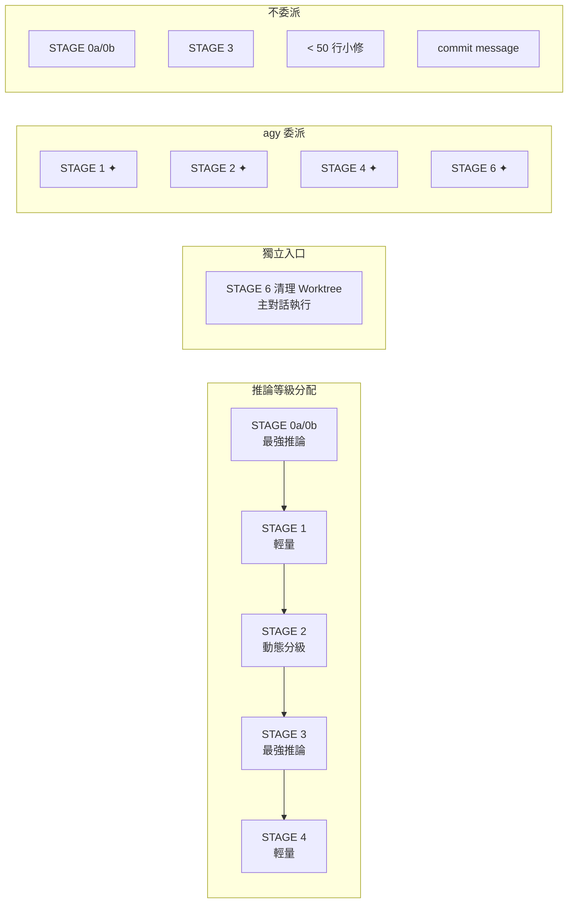

# gen-dev-workflow 全階段分析報告

## 總覽

`gen-dev-workflow` 是一個**全自動開發流程編排器**，從使用者說「幫我做 X 功能」到 PR 建立，共 6 個 stage（0a → 0b → 1 → 2 → 3 → 4），外加兩個獨立入口的 STAGE 5（回覆 PR review）與 STAGE 6（PR 合併後清理 worktree），以及小修正用的 **quick 模式**（單暫停點快速通道，不建 worktree）。核心機制是 **Claude 做總指揮 + `agy` CLI 做委派執行**。自 STAGE 1 起，整條流程搬進一個獨立 worktree 執行——worktree 才是真正的隔離邊界。

Model 別名**綁在各 agent 檔 frontmatter**（`.claude/agents/*.md`，用 `opus`/`sonnet` 別名），而 **effort 參數已從 frontmatter 中全數移除**，改為在**派發任務時顯式帶入**。SKILL.md 定義了**推論等級表**（對應的 model 與 effort 參數），以此維持不同 stage 之間的差異化配置。

---

## 各階段詳細分析

### STAGE 0a：功能規格（What & Why）

| 項目 | 內容 |
|------|------|
| **Agent** | planner |
| **Model** | 最強推論（planner frontmatter：`model: opus`；派發時帶入 `effort: xhigh`） |
| **委派** | 無 agy 委派，Claude 親自執行 |
| **並行** | 🟢 並行 2 條線：A. 專案 context 收集（讀檔 / git log）B. 相似功能代碼調查 |
| **產出** | `docs/features/YYYY-MM-DD-<feature>.md`（使用者故事、驗收條件、範圍邊界） |
| **暫停點** | ⏸ 展示規格 → 等使用者確認 |

**執行工作：**
1. 接收使用者需求描述
2. 並行啟動兩個研究任務（唯讀，不寫檔）
3. 收斂研究結果，撰寫功能規格文件
4. 暫停等待確認

---

### STAGE 0b：實作計畫（How）

| 項目 | 內容 |
|------|------|
| **Agent** | planner |
| **Model** | 最強推論（planner frontmatter：`model: opus`；派發時帶入 `effort: xhigh`） |
| **委派** | 無 agy 委派 |
| **並行** | 無 |
| **產出** | `docs/plans/YYYY-MM-DD-<feature>.md`（資料結構、檔案異動、任務拆分 + 複雜度標註） |
| **暫停點** | ⏸ 展示計畫 → 等使用者確認 |

**執行工作：**
1. 讀取 STAGE 0a 確認後的功能規格
2. 分析 codebase 結構
3. 拆分任務、標註複雜度等級（供 STAGE 2 model 選擇用）
4. 撰寫實作計畫文件
5. 暫停等待確認

---

### STAGE 1：建立 Issue + Worktree

| 項目 | 內容 |
|------|------|
| **Agent** | gen-gh-issue skill + brancher |
| **Model** | 輕量（brancher frontmatter：`model: sonnet`；派發時帶入 `effort: high`）——純 IO，且建立前有暫停點人肉把關 |
| **委派** | ✦ agy 執行 `gh issue create/view` + `git worktree add` + `flutter pub get` |
| **並行** | 無 |
| **產出** | GitHub Issue + Git 分支 + **獨立 worktree** |
| **暫停點** | ⏸ 展示 Issue 標題/內容 + 分支/worktree 名稱 → 等使用者確認或修改 |

**執行工作：**
1. 取得 Issue 內容（正常路徑用 gen-gh-issue 產五區段 body；issue-id 路徑用 `gh issue view <id>` 解析既有 issue）
2. 依 `ticket-id-dev-prep` 規則決定 branch prefix + slug，草擬分支/worktree 名稱
3. 暫停讓使用者確認/修改
4. 確認後由 brancher 建立 **worktree + branch**（`git worktree add -b <branch> <worktree-path> origin/main`），主對話 `cd` 進新 worktree 繼續後續所有 stage

**Worktree 命名與落地：** worktree 目錄為 `.claude/worktrees/<repo-name>-<ISSUE-ID>-<slug>`，建在當前 repo 內的 `.claude/worktrees/` 下，base 預設 `origin/main`。branch 名稱 `<prefix>/<ISSUE-ID>-<slug>`（prefix 含 `YYYYMM`）。若目標 branch 或 worktree 路徑已存在則停止回報，不默默重用或覆蓋。這個 worktree 是**整個 workflow 的長駐工作區**；主流程（STAGE 1–4）全程只用不刪，連 PR 合併都不會自動清除——要等使用者手動觸發 STAGE 6 才移除（刻意不自動清，避免 PR 合併後仍需修改時誤刪工作區）。

**與 STAGE 2 臨時 worktree 的區別：** STAGE 1 的 worktree 是整個 workflow 的長駐工作區；STAGE 2 並行任務用的 `isolation: 'worktree'` 只是子 agent 層級的臨時隔離（跑完自動清除、不留存），僅避免並行任務互踩工作區，兩者不是同一回事。

---

### STAGE 2：實作（核心 Stage）

| 項目 | 內容 |
|------|------|
| **Agent** | implementer |
| **Model** | 實作動態分級（見下表）｜驗收走 verifier agent（最強推論） |
| **委派** | ✦ agy 負責代碼 + 測試 + commit；驗收委派 verifier agent（frontmatter：`model: opus`；且必須顯式帶入 `effort: xhigh`） |
| **並行** | 🟢 條件式並行（≥2 獨立任務且寫入路徑不重疊） |
| **產出** | 實作代碼 + 測試 + commits |
| **暫停點** | ⏸ 每個任務/每批並行完成後展示變更 + 測試結果 → 等確認 |

**Model 動態分級（STAGE 2 內部，僅指「委派給 agy 寫代碼」的 model）：**

| 任務複雜度 | 委派等級 | 範例 |
|-----------|-----------|------|
| 觸及 1–2 檔、規格完整、機械性 | 快/便宜（agy 內部 fast model） | 新增 DTO 欄位、補 util function |
| 觸及多檔、需整合協調 | 標準 | 跨 service 串接、改既有流程 |
| 需設計判斷或廣泛 codebase 理解 | 最強推論 | 重構狀態機、新增跨層架構 |

> **驗收與實作分離**：上表是「agy 寫代碼」用的浮動等級；**驗收固定委派 verifier agent**（frontmatter：`model: opus`；且必須顯式帶入 `effort: xhigh`），不隨實作任務浮動。刻意讓驗收等級 ≥ 實作等級，避免產代碼的便宜 model 自審（與 STAGE 3 同源交叉檢查的邏輯一致）。

**執行工作：**
1. 解析實作計畫，判斷並行/序列模式
2. 逐任務（或並行批次）分派給 agy
3. 委派 verifier agent（最強推論）做兩階段驗收：spec compliance → code quality
4. 每個任務完成後暫停展示結果
5. 失敗時進入 retry 迴圈（最多 2 次重派）

**並行契約（三規則）：**
1. 每個並行單元有明確寫入檔案清單
2. 共享資源（pubspec.yaml、DI 註冊等）只能有一個 owner
3. 結果聚合 + 失敗短路機制

---

### STAGE 3：審查

| 項目 | 內容 |
|------|------|
| **Agent** | reviewer |
| **Model** | 最強推論（reviewer frontmatter：`model: opus`；派發時帶入 `effort: xhigh`）——根因判斷 |
| **委派** | **不委派 agy**（審查不可外包） |
| **並行** | 無 |
| **產出** | 審查報告 |
| **暫停點** | ⏸ 展示報告 → 通過則進 STAGE 4，不通過則退回 STAGE 2 |

**執行工作：**
1. reviewer agent 親自審查所有變更
2. 產出審查報告
3. 不通過 → 退回 STAGE 2 修正 → 再回 STAGE 3（迴圈）

**設計考量：** 審查用最強推論是為了避免「自己審自己」（實作走標準或更便宜等級，reviewer 刻意用不同源的最強推論交叉驗證）。

---

### STAGE 4：發布

| 項目 | 內容 |
|------|------|
| **Agent** | publisher |
| **Model** | 輕量（publisher frontmatter：`model: sonnet`；派發時帶入 `effort: high`）——重活已委派 agy，發布前有暫停點人肉把關 |
| **委派** | ✦ agy 分析 Diff → 產 PR 草稿；Claude 校對 |
| **並行** | 無 |
| **產出** | GitHub PR |
| **暫停點** | ⏸ 展示 PR 草稿 → 等使用者確認發布 |

**執行工作：**
1. agy 分析 branch diff，生成 PR 描述草稿
2. Claude 校對草稿品質
3. 暫停讓使用者確認
4. 確認後發布 PR

---

### STAGE 5：回覆 PR Review（獨立入口）

| 項目 | 內容 |
|------|------|
| **Agent** | responder → reviewer → publisher |
| **Model** | 輕量（responder，帶 `effort: high`）→ 最強推論（reviewer，帶 `effort: xhigh`）→ 輕量（publisher，帶 `effort: high`） |
| **委派** | 無 agy 委派 |
| **並行** | 無 |
| **觸發** | 使用者說「PR #42 有新的 review 意見」 |

**執行工作：**
1. responder 逐條處理 PR review 意見
2. reviewer 重新審查修改
3. publisher 更新 PR

---

### STAGE 6：清理 Worktree（獨立入口）

| 項目 | 內容 |
|------|------|
| **Agent** | worktree-close-cleanup skill |
| **Model** | —（skill 於主對話執行，無獨立綁定） |
| **委派** | ✦ agy 執行 `git worktree remove` |
| **並行** | 無 |
| **產出** | 移除 STAGE 1 建立的 worktree（**對應 branch 一律保留、不刪除**） |
| **觸發** | PR **實際合併後**，使用者說「PR #42 合併了，清理 worktree」 |

**執行工作：**
1. 呼叫 worktree-close-cleanup skill 移除 STAGE 1 建立的 worktree
2. 只移除 worktree 本身，對應 branch 保留不刪除（沿用 worktree-close-cleanup 既有規則）
3. 完成後流程結束

**設計考量：** 不自動觸發——workflow 不偵測 PR 合併狀態並自動清理，需使用者明確告知已合併才執行，避免 PR 還可能需要修改時誤刪工作區。

---

### Quick 模式：小修正快速通道（獨立入口）

| 項目 | 內容 |
|------|------|
| **觸發** | `/gen-dev-workflow quick <描述或 #issue>`、「快速修正 <描述>」 |
| **適用** | 預期 diff 小（約 ≤3 檔）、無架構變動、無新依賴、不需規劃文件 |
| **流程** | 建 branch（不建 worktree）→ 主對話直接實作（不委派 implementer/agy）→ reviewer 單 lens 快掃 → gen-pr 產草稿 → 發布 |
| **暫停點** | 只有一個：PR 草稿確認前 |
| **State** | 照寫 `<branch-slug>.json`（`mode: "quick"`），續接與 PR MERGED 自動刪檔複用既有機制 |

**設計考量：**
- 砍掉所有儀式（spec/plan 文件、issue 強制、worktree、逐任務暫停），唯一保留的品質閘門是 **reviewer 交叉審查**——「不讓同源 model 自審」是整條 workflow 不可砍的不變式。
- 不建 worktree ⇒ 同一 repo 同時只能跑一個 quick；需要多並行走完整流程。
- 中途發現超出小修正範圍（多檔設計判斷、新依賴、動架構）→ 停下，帶著已建 branch 升級轉入完整流程 STAGE 2，不硬撐。

---

## Model 與委派策略總覽

Model 別名綁在各 agent 檔的 frontmatter（`.claude/agents/*.md`），而 **effort 參數則在任務派發時顯式帶入**。

### 推論等級表（等級 → 綁定）：

| 等級 | model（frontmatter 綁定，未變） | effort（呼叫時明確帶入） | 綁定的 agent |
|------|-----------------|-------------|-------------|
| 最強推論 | `model: opus` | `effort: xhigh` | planner、reviewer、verifier |
| 標準 | `model: sonnet` | `effort: max` | implementer |
| 輕量 | `model: sonnet` | `effort: high` | brancher、responder、publisher |
| 快/便宜 | agy 內部 fast model（不在 Claude 側綁定） | — | STAGE 2 機械性任務 |

### 綁定原則：
- model 一律用**別名**（`opus`/`sonnet`），不綁版本 ID——CLI 自動解析到當代 model。這部分仍由 frontmatter 管理。
- effort **派發時必須明確帶入**：`Task("<agent>", ..., effort: "<本表對應值>")`。若不帶參數，子 agent 將預設繼承主對話 session 目前的 effort，這會導致 stage 間的差異化失效。
- Workflow `agent()` 呼叫：`agentType: '<agent 名>'` 仍沿用 frontmatter 的 model 綁定；effort 另用 `opts.effort` 依本表帶入。

> 🔴 **已知風險：`effort: 'xhigh'` 導致 400 錯誤**
> 曾有實測案例顯示，當 thinking 未開啟時，於 Opus 4.8 上呼叫 `effort: 'xhigh'` 可能會觸發 `400 output_config.effort 'xhigh' is not supported when thinking is disabled on this model`。若派發時遇到此錯誤，應暫時將該次呼叫的 effort 降為 `high` 以恢復可用性，切勿默默將全表降級。



### STAGE 6 委派規則
- STAGE 6 清理 worktree 走 ✦ agy 委派 `git worktree remove`（純 IO，只移除 worktree、不刪 branch，決策成本低）

### 不委派 agy 的硬規則
- commit message（直接依 diff 生成，省一次 context 來回）
- 單一檔案 < 50 行的小修正
- STAGE 3 審查報告（reviewer 親自判斷）

---

## 狀態持久化與 Token Budget Gate

### 狀態檔：每個 workflow 一個檔（存於各自 worktree，檔名用 branch）

state 不是單一檔，而是 `.claude/workflow-state/` 目錄下**每個 workflow 一個檔**：

```
<worktree-path>/.claude/workflow-state/<branch-slug>.json   ← 已建 worktree 的 workflow（STAGE 1 之後，存於新 worktree 內）
.claude/workflow-state/.pending-<wf-id>.json                ← 尚無 worktree 時的暫存（STAGE 0a / 0b，存於原 repo）
```

STAGE 1 之後的 state 檔存在**各自 worktree 內部**，不再是主 repo 的同一目錄——連檔名撞名的可能性都不存在。

- 每個 stage 完成後寫入對應 workflow 的檔
- 支援 `sequence`（完整流程）和 `jump`（跳入特定 stage）兩種模式
- 記錄 `interrupted_by` 欄位追蹤中斷原因
- 記錄 `workflow_id`（`wf-<epoch>-<rand4>`）作為 pending 階段的唯一識別

### 多 workflow 並行（隔離設計）

**隔離 key 分兩段：STAGE 0a/0b 靠 workflow-id、STAGE 1 之後靠獨立 worktree。** 同一 repo 可同時跑多個獨立 workflow（多終端 / 多 session）。自 STAGE 1 起每個 workflow 都在自己的 worktree 目錄裡，state 檔天然分開存放於各自 worktree 的 `.claude/workflow-state/`，彼此零衝突——不需要鎖、不需要中央索引。worktree 是比 branch 更徹底的隔離：工作目錄本身就分開，不是靠同一目錄切 branch。

唯一邊界是「兩個流程都還在 STAGE 0a/0b（尚無 worktree，仍在原 repo 目錄）」這個短暫窗口。此時多個並行 workflow 共用同一個原 repo 的 `.claude/workflow-state/`，branch 推導不出唯一檔，改靠 **workflow-id 持久化**識別：

| 機制 | 解決的問題 |
|------|-----------|
| `workflow_id` 寫進 `.pending-<wf-id>.json` 內容 | session 中斷後，pending 檔不再是無主孤兒，可被精準認領 |
| 進度行帶 `[<wf-id>]` / `[<branch-slug>]` 前綴 | 多個並行流程的輸出一眼可辨 |
| 狀態定位「先認 wf-id、再認 branch」 | 不再用 `git branch --show-current` 誤撿別人的 pending 檔 |

### Token Budget Gate

| Context 用量 | 行為 |
|---|---|
| < 60k | 正常流程 |
| 60–100k | ⚠️ 提示精簡，委派 agent 只回摘要 |
| 100–150k | ⚠️ 強制走委派路徑，主對話只保留高層判斷 |
| > 150k | ⛔ 強制 checkpoint，主動切 session |

**閉環機制：** 超標時完成當前最小單元 → 寫入 state → commit 未存變更 → 告知使用者 → 新 session 自動續接。

---

## 優缺點分析

### ✅ 優點

| 面向 | 優點 | 說明 |
|------|------|------|
| **架構完整性** | 端到端覆蓋 | 從需求到 PR 全流程自動化，6 個 stage 涵蓋 SDLC 核心環節 |
| **成本優化** | Model 動態分級 | 不是所有任務都用 Opus，機械性工作用便宜 model，真正降成本 |
| **品質保障** | 雙層交叉檢查 | 兩道防線都刻意避免「自己審自己」：(1) STAGE 2 驗收委派獨立 verifier agent（最強推論），與寫代碼的 agy（可能是便宜 model）不同源；(2) STAGE 3 reviewer 用最強推論，與 implementer 不同源。驗收等級刻意 ≥ 實作等級，確保把關強度。quick 模式砍掉所有儀式時也保留這道閘門 |
| **換代維護** | Policy over models | model 綁在 agent frontmatter（別名），effort 則在呼叫時顯式帶入。當 model 換代時，由於使用了別名，frontmatter 免改；調整某角色 effort 等級只需更改派發參數即可。 |
| **韌性** | Token Budget Gate 閉環 | 長流程不會因 context 爆炸而丟失進度，state 持久化是真正的救生圈 |
| **可恢復性** | per-worktree state 檔 | session 中斷後可續接，`interrupted_by` 區分主動離開 vs 系統保護 |
| **多流程並行** | worktree 隔離 + workflow-id | 同 repo 可同時跑多個 workflow，STAGE 1 起各自在專屬 worktree 內達成零鎖並行（工作目錄本身分開，比純切 branch 更徹底）；STAGE 0a/0b pending 階段靠 workflow-id 持久化補上唯一缺口 |
| **並行效率** | 條件式並行 + 三規則契約 | 不盲目並行，有明確的衝突偵測和失敗處理策略 |
| **人在迴路** | 關鍵暫停點 | 規格、計畫、分支、每個任務、審查、PR 都有確認點，不會脫韁 |
| **靈活入口** | Quick Commands + jump mode + quick 模式 | 可以從任意 stage 切入，不強迫跑完整流程；小修正有專屬單暫停點快速通道 |
| **退回機制** | STAGE 3 → STAGE 2 迴圈 | 審查不通過不是死路，有明確的退回路徑 |
| **失敗處理** | 分級 retry + 人工兜底 | 重試有上限（2 次），超過就停下來問人，不無限迴圈 |

### ❌ 缺點

| 面向 | 缺點 | 嚴重度 | 說明 |
|------|------|--------|------|
| **過度工程** | ~~小功能走全流程太重~~ | ✅ 已解決 | quick 模式已補上逃生艙：小修正走「branch → 直改 → reviewer 快掃 → PR」單暫停點通道。殘餘風險：「是否屬於小修正」的判斷仍靠 LLM 自律，quick 被拿來跑大功能時只有「中途升級轉完整流程」這條軟性防線 |
| **暫停點過多** | Human-in-the-loop 頻率太高 | 🟡 中 | 正常路徑就有 6 個固定暫停點（STAGE 0a/0b/1/3/4 各一 + STAGE 2 每任務一次），外加條件式的「模糊需求」暫停。STAGE 2 任務多時暫停次數線性膨脹，使用者必須一直盯著等確認，「自動驅動」的承諾被密集確認打斷 |
| **agy 依賴** | 外部 CLI 是單點故障 | 🟡 中 | 雖說有 fallback，但 `agy` 不在 PATH 時的 fallback 行為描述模糊——「功能仍可運作但不會委派」到底怎麼運作？哪些 stage 受影響？ |
| **Model 假設** | 綁定 Anthropic 模型族 | 🟢 低 | 已大幅收斂：版本 ID 全數移除，model/effort 綁在 agent frontmatter（別名），SKILL.md 只寫推論等級名——同代升級與跨代換代都免改。殘餘綁定：`opus`/`sonnet` 別名與 effort 參數仍是 Claude Code 專有，若換到非 Anthropic 生態，需重寫的只剩每個 agent 檔的兩行 frontmatter，等級語意（最強推論/標準/輕量）可原樣搬移 |
| **狀態檔脆弱** | JSON 手動管理無校驗 | 🟡 中 | per-worktree state 檔仍是 LLM 手寫 JSON，沒有 schema validation、沒有版本號、沒有 checksum。手動編輯或 stage 寫入半途中斷就會腐壞，下次續接時可能靜默出錯。（workflow-id 持久化 + per-worktree 隔離已解決「pending 檔無主孤兒」與「撞名」子問題，但 JSON 本身的完整性校驗仍缺） |
| **並行複雜度** | 契約規則難以程式化驗證 | 🟡 中 | 「寫入路徑不重疊」「共享資源指定唯一 owner」靠 planner 在計畫中標好——但 planner 本身是 LLM，標錯怎麼辦？沒有靜態檢查機制 |
| **Context 估算** | Token 用量無法精確測量 | 🟡 中 | Token Budget Gate 依賴「評估主對話 context 用量」，但 LLM 無法精確知道自己的 context 用了多少 token。60k / 100k / 150k 的閾值在實務上只能靠啟發式猜測 |
| **缺乏回滾** | 沒有 undo/rollback 機制 | 🟡 中 | STAGE 2 如果 implementer 寫了爛 code 且已 commit，STAGE 3 退回 STAGE 2 只是「重做」，不會自動 `git revert`。壞 commit 會留在歷史中 |
| **STAGE 5/6 脫節** | 獨立入口與主流程不連貫 | 🟡 低 | STAGE 5、6 都是「獨立入口」。STAGE 5 串聯 responder → reviewer → publisher，邏輯與主流程部分重疊卻又獨立，若修改引入新 bug 沒有機制退回 STAGE 2；STAGE 6 清理 worktree 也脫離主流程，靠使用者手動觸發、不自動偵測 PR 合併狀態，誤觸發（PR 未真正合併就清理）無自動防護，只靠使用者自律 |
| **文件 vs 執行** | Skill 是文件，不是程式 | 🔴 高 | 整個 workflow 是 markdown 指令文件，靠 LLM「讀懂後遵守」。沒有程式碼強制執行流程、沒有 state machine 實作、沒有 guard clause。LLM 可能跳過暫停點、忘記寫 state、算錯 context 用量——一切靠「希望」|
| **錯誤傳播** | 早期 stage 錯誤會放大 | 🟡 中 | 如果 STAGE 0a 的功能規格就有偏差，使用者確認了（可能沒仔細看），後面所有 stage 都在錯誤基礎上工作。flow 沒有後期發現早期問題的回溯機制 |

## 🐧 Linus 式總結

> 「這個 workflow 設計的核心問題是：它試圖用 markdown 文件模擬一個 state machine，然後『希望』LLM 會遵守所有規則。這就像寫一份『請不要碰記憶體』的備忘錄給 C 程式員，然後期待 segfault 不會發生。」

**最值得保留的設計：** Token Budget Gate 閉環 + per-worktree state 檔的中斷續接。這是解決 LLM context 爆炸這個**真實問題**的務實方案。多 workflow 並行更是把「並行衝突」這個特殊情況用數據結構直接消滅——STAGE 1 起各流程各佔一個獨立 worktree，工作目錄本身分開，連 state 檔撞名都不可能，而不是加鎖去處理它——好品味。

**已修掉的問題：** (1) 缺少輕量模式——quick 模式已補上（單暫停點、不建 worktree、branch → 直改 → reviewer 快掃 → PR），10 行 fix 不再跑 6 個 stage。(2) 參數配置收斂——model 別名收斂於 frontmatter 綁定，effort 配置則收斂於推論等級表；雖呼叫時需明確指明 effort（因 frontmatter 不再提供此屬性），但透過統一定義降低了 model 換代的維護稅。

**最該修的問題（更新後）：** 暫停點密度。正常路徑 6 個固定暫停點、STAGE 2 逐任務再線性膨脹——「自動驅動」的承諾被密集確認打斷。下一步值得考慮讓使用者在啟動時選擇確認粒度（例如「只在規格、審查、PR 三處暫停」的信任模式）。

**最危險的假設：** markdown 指令 = 程式碼保證。它不是。
