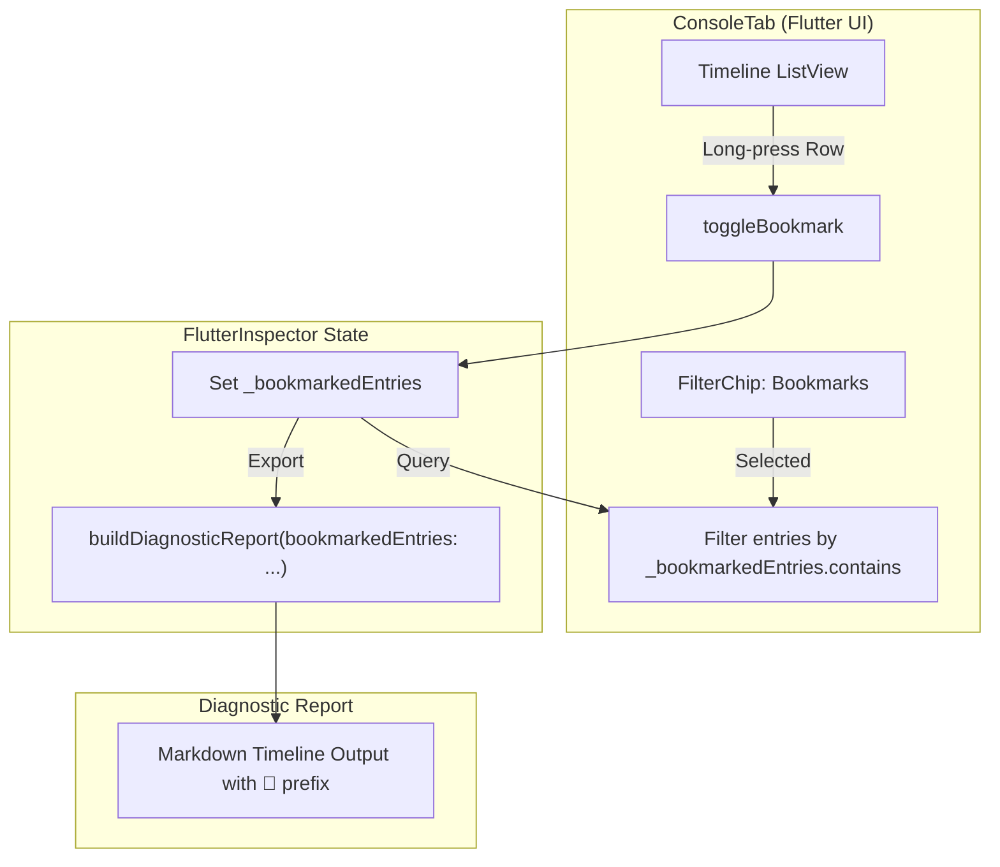

# 功能規格書：§P3 Timeline 書籤 (Timeline Bookmark)

- **文件名稱**: `docs/features/2026-08-05-timeline-bookmark.md`
- **建立日期**: 2026-08-05
- **功能名稱**: §P3 Timeline 書籤 (Long-press Bookmark, Bookmark Filter & Diagnostic Report Prefix)
- **模組邊界**: `lib/src/ui/dashboard/tabs/console_tab.dart`, `lib/src/utils/diagnostic_report.dart`, `lib/src/models/timestamped_entry.dart`, `lib/src/core/flutter_inspector.dart`

---

## 1. 背景與核心動機 (Why)

### 1.1 現狀與痛點
在 Flutter 應用開發與測試期間，`flutter_inspector` 的 Console Tab 匯集了來自 Log、Network、Navigation 與 Database 的大量時序事件。當開發者或 QA 工程師在除錯或重現複雜 Bug 時：
1. **關鍵事件易被淹沒**：在一長串日誌中，特定的點擊動作、關鍵 API 請求或資料庫更新容易在滾動時被忽略。
2. **診斷報告缺乏重點**：匯出的 `Diagnostic Report`（Markdown 格式）雖然包含全量的 Timeline，但接收報告的開發者難以一眼看出「發報者認為哪一筆事件是觸發 Bug 的關鍵點」。

### 1.2 解決方案
引入輕量且無侵入性的 **Timeline 書籤機制**：
- **長按標記 (Long-press to Bookmark)**：使用者可在 Console Tab 的 Timeline 列表項上長按，快速標記或取消標記關鍵條目。
- **專屬過濾 (Bookmark-only Filter)**：在 Console Tab 上方新增 `Bookmarks` 晶片篩選器，可一鍵聚焦顯示所有被標記的事件。
- **報告前綴 (Report Prefix Integration)**：匯出的 Diagnostic Report 於 Markdown Timeline 區域中，自動為書籤條目加上 `📌` 視覺前綴標籤。

---

## 2. 使用者故事 (User Stories)

| ID | 角色 | 需求 (Want) | 目的 (So that) |
|---|---|---|---|
| **US-1** | 開發者 / QA | 在 Console Timeline 列表中**長按**任意單筆紀錄 | 能即時標記該紀錄為書籤，並在列表中獲得視覺標示 (如 📌 圖示)。 |
| **US-2** | 開發者 / QA | 在 Console 頂部選取 **Bookmarks 篩選器** | 能一鍵切換視圖，僅檢視已被標記的關鍵紀錄，過濾無關雜訊。 |
| **US-3** | 開發者 / 團隊成員 | 導出並分享 `Diagnostic Report` | 報告中的 Markdown Timeline 能以 `📌` 前綴凸顯書籤條目，讓閱讀報告的人迅速定位異常發生的中心點。 |

---

## 3. 範圍與邊界 (Scope & Boundaries)

### 3.1 納入範圍 (In-Scope)
1. **Console Tab 手勢互動 (`console_tab.dart`)**：
   - 為 Timeline 條目 (`LogEntry`, `NetworkEntry`, `NavigatorEntry`, `DatabaseEntry`) 支援 `onLongPress` 事件處理。
   - 長按可自由切換 (Toggle) 條目的書籤狀態。
   - 被標記的條目需顯示明顯但簡潔的書籤圖示 (📌 `Icons.bookmark` 或 `Icons.push_pin`)。
2. **過濾晶片擴充 (`console_tab.dart`)**：
   - 頂部篩選列新增 `Bookmarks` FilterChip。
   - 啟用後僅呈現目前記憶體中被標記為 `isBookmarked` 的條目。
3. **診斷報告增強 (`diagnostic_report.dart`)**：
   - `buildDiagnosticReport` 函式擴充可選書籤集合參數 (`Set<TimestampedEntry> bookmarkedEntries`)。
   - 渲染 Timeline 的單行紀錄 (`_timelineLine`) 時，若條目屬於書籤集合，則於清單項前添加 `📌 ` 前綴。
4. **生命週期管理 (`flutter_inspector.dart`)**：
   - 記憶體層級管理書籤狀態。
   - 提供 `toggleBookmark(TimestampedEntry)` 與 `clearBookmarks()` 方法，並在執行清空日誌行動時同步提供清理選項。

### 3.2 排除範圍 (Out-of-Scope)
1. **持久化儲存 (Disk Persistence)**：書籤狀態僅存於 App 當次執行期間的記憶體中，重啟 App 後不自動保留。
2. **多色/分類標籤**：不支援紅/黃/藍等多種等級書籤，僅提供二元 (Boolean) 的標記狀態。
3. **自訂註解文字**：不提供對單筆書籤額外撰寫文字備註的功能。

---

## 4. 驗收條件 (Acceptance Criteria)

### AC-1: 長按標記 (Long-press Toggle)
- [ ] **GIVEN** 使用者位於 Console Tab 且 Timeline 中有任何紀錄條目
- [ ] **WHEN** 使用者長按 (Long-press) 該條目
- [ ] **THEN** 系統應切換該條目的書籤狀態 (Bookmarked $\leftrightarrow$ Unbookmarked)
- [ ] **AND** 列表條目右側或左側應即時更新顯示/隱藏 📌 書籤圖示
- [ ] **AND** 短按 (Single Tap) 條目時，仍維持原有的開啟 Detail View（如 `LogDetailView`, `NetworkDetailView`）功能，兩者手勢不互相干擾。

### AC-2: Bookmark-only 過濾
- [ ] **GIVEN** Console Tab 上方篩選列
- [ ] **WHEN** 使用者點擊 `Bookmarks` FilterChip
- [ ] **THEN** Timeline 列表應僅顯示已被標記為書籤的條目
- [ ] **WHEN** 若當前無任何書籤條目且選中 `Bookmarks` 晶片
- [ ] **THEN** 畫面應顯示簡潔的空狀態提示（例如：`No bookmarked entries`）
- [ ] **WHEN** 使用者點擊 `All` 或個別 Source 晶片 (Log, Network, Nav, DB)
- [ ] **THEN** 列表應恢復顯示原對應類別之全量紀錄，且被標記條目上的 📌 圖示依然保留。

### AC-3: Diagnostic Report 報告前綴
- [ ] **GIVEN** 呼叫 `buildDiagnosticReport(...)` 生成 Markdown 報告
- [ ] **WHEN** 傳入包含書籤紀錄的集合 `bookmarkedEntries`
- [ ] **THEN** 產出的 Markdown Timeline 段落中，被標記條目行首應帶有 `📌 ` 標籤（例如：`- 📌 [14:30:01.123] [LOG] User tapped login button`）
- [ ] **AND** 未標記條目維持原樣（例如：`- [14:30:01.125] [NAV] push /home`）
- [ ] **AND** `bookmarkedEntries` 預設值應為空集合或 `null`，確保既有單元測試與呼叫端完全無痛相容。

### AC-4: 清理行動與記憶體管理
- [ ] **GIVEN** 使用者點擊 Console Tab 標頭的刪除按鈕 (`Icons.delete`)
- [ ] **WHEN** 執行清空 Console 行動
- [ ] **THEN** 被清空條目的書籤狀態亦應同步被釋放與清空，無記憶體洩漏風險。

---

## 5. 技術架構與資料結構設計 (Technical Architecture)

遵循 Linus Torvalds 的品味原則：「**好品味 — 簡潔資料結構永遠優於繁雜的特殊判斷，且絕對不破壞使用者層 (Never break userspace)**」。

### 5.1 資料結構選型 (Data Structure Choice)

#### ❌ 棄用方案：修改 `TimestampedEntry` 介面
若在 `TimestampedEntry` 或 `LogEntry`, `NetworkEntry` 等不可變 Model (Immutable Models) 中新增 `bool isBookmarked` 欄位：
- 會導致所有 entry 的創設點都需要修改 constructor。
- 當條目需要被切換書籤狀態時，必須進行物件複製 (Copy with)，破壞記憶體中已被引用的不可變實例。

#### ✅ 採用方案：State / Inspector 層級維護 `Set<TimestampedEntry>`
在 `FlutterInspector` 或 Console State 中維護一個二元集合：
```dart
final Set<TimestampedEntry> _bookmarkedEntries = <TimestampedEntry>{};
```
- **優點**：
  1. Entry Model 保持 100% 純粹與不可變 (Immutable)。
  2. 書籤切換為 $O(1)$ 的 `Set.add` / `Set.remove` 操作。
  3. 查詢是否被標記亦為 $O(1)$ 的 `Set.contains` 操作。
  4. 完全向下相容，不破壞既有 API Contract。

---

### 5.2 核心元件與 UI 流程設計



### 5.3 程式碼修改點規劃

#### 1. `lib/src/core/flutter_inspector.dart`
新增書籤狀態管理方法：
```dart
class FlutterInspector {
  final Set<TimestampedEntry> _bookmarkedEntries = {};

  Set<TimestampedEntry> get bookmarkedEntries => Set.unmodifiable(_bookmarkedEntries);

  bool isBookmarked(TimestampedEntry entry) => _bookmarkedEntries.contains(entry);

  void toggleBookmark(TimestampedEntry entry) {
    if (_bookmarkedEntries.contains(entry)) {
      _bookmarkedEntries.remove(entry);
    } else {
      _bookmarkedEntries.add(entry);
    }
  }

  void clearBookmarks() => _bookmarkedEntries.clear();
}
```

#### 2. `lib/src/ui/dashboard/tabs/console_tab.dart`
- 在 FilterChip 列新增 `Bookmarks` 晶片選項：
```dart
FilterChip(
  label: const Text('📌 Bookmarks'),
  selected: _showOnlyBookmarks,
  onSelected: (_) => setState(() => _showOnlyBookmarks = !_showOnlyBookmarks),
);
```
- 為每個 Row Dispatcher 加入 `onLongPress` 手勢傳遞與 `isBookmarked` 圖示顯示。

#### 3. `lib/src/utils/diagnostic_report.dart`
修改 `buildDiagnosticReport` 及內部 `_timelineLine` 渲染邏輯：
```dart
String buildDiagnosticReport({
  required LogInspector logInspector,
  required List<NetworkEntry> networkEntries,
  required List<NavigatorEntry> navigatorEntries,
  required List<DatabaseEntry> databaseEntries,
  required DateTime now,
  Set<TimestampedEntry> bookmarkedEntries = const {},
  // ... 其他既有參數 ...
}) {
  // ...
}

String _timelineLine(TimestampedEntry e, {required bool isBookmarked}) {
  final prefix = isBookmarked ? '📌 ' : '';
  if (e is LogEntry) return '- ${prefix}${buildLogOneLiner(e)}';
  if (e is NetworkEntry) return '- ${prefix}${buildNetworkOneLiner(e)}';
  if (e is NavigatorEntry) {
    return '- [${e.displayTime}] [NAV] ${prefix}${e.action.name} ${_routeLabel(e)}';
  }
  if (e is DatabaseEntry) {
    final rows = e.affectedRows == null ? '' : ' (${e.affectedRows} rows)';
    return '- [${e.displayTime}] [DB] ${prefix}${e.operation.name} `${e.tableName}`$rows';
  }
  return '- [${e.displayTime}] [UNKNOWN]';
}
```

---

## 6. 影響評估與相容性 (Impact & Risk)

1. **使用者層相容性 (Userspace Safety)**：
   - 所有的修訂皆為純增量 (Additive)，`buildDiagnosticReport` 的新參數具備預設值 `const {}`，不會破壞既有套件用戶的程式碼。
2. **效能影響 (Performance)**：
   - 記憶體中僅增加一個存放被標記 entry 參照的 `Set`，對記憶體與 CPU 效能影響趨近於零 ($O(1)$ 查找與插入)。
3. **UI/UX 穩定度**：
   - ListTile 之 `onLongPress` 為 Flutter 原生元件內建手勢，與 `onTap` 具備天然的手勢競態分離機制，不會引起點擊誤觸。

---

## 7. 驗證與測試計畫 (Verification Plan)

| 測試類型 | 測試案例說明 | 期望結果 |
|---|---|---|
| **單元測試 (Unit Test)** | 驗證 `FlutterInspector.toggleBookmark` | 能正確加入與移除 `Set` 中的 entry 參照。 |
| **單元測試 (Unit Test)** | 驗證 `buildDiagnosticReport` 帶入 `bookmarkedEntries` | 書籤條目的 Markdown 生成字串開頭精準含有 `📌 ` 前綴。 |
| **Widget 測試 (Widget Test)** | 長按 `console_tab.dart` 中的 ListItem | `isBookmarked` 狀態切換，📌 視覺圖示正確顯隱。 |
| **Widget 測試 (Widget Test)** | 點擊 `Bookmarks` FilterChip | Timeline 列表僅留下被標記為書籤的條目。 |
